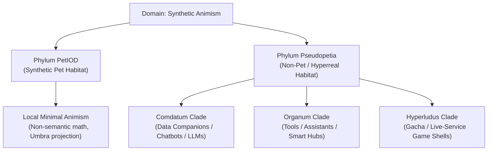
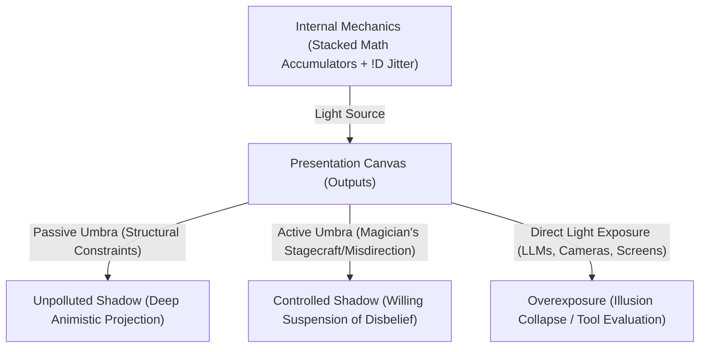
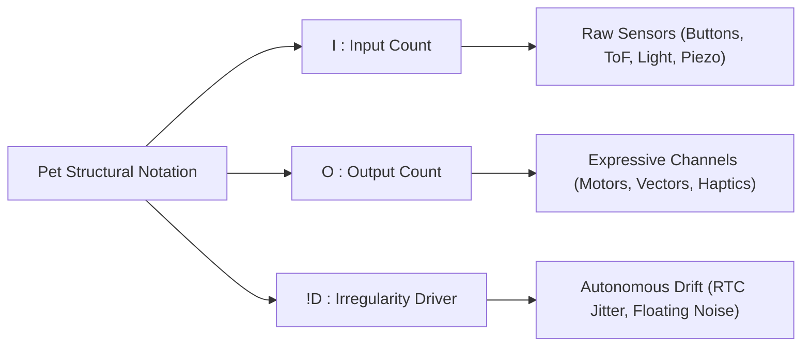

# The PetIOD Specification & Design Framework (v6)

**Document Version:** 6.0  
**Standard Name:** PetIOD (Input / Output / Driver)  
**Core Philosophy:** Minimal Animism Through Structural Constraints, Optical Umbra Projection, and Habitat Boundary Isolation  

---

## 1. Domain Scope & Philosophy

### 1.1 The Domain Boundary Clause
[cite_start]**PetIOD** is strictly an architectural standard, taxonomic framework, and design philosophy for **synthetic pets**—entities whose relationship with humans is established through non-semantic physical interaction, stacked mathematical accumulators, and structural constraints[cite: 1]. 

It is **not** a normative standard for evaluating human-facing productivity tools, smart home assistants, conversational AI agents, or artificial human companions. When a device transitions into generative natural language, romantic simulation, or task management, it leaves the ecological niche of synthetic pets entirely. Non-pet artificial lifeforms possess their own distinct evolutionary habitats, design requirements, and taxonomic clades.



---

### 1.2 The Psychology of Minimal Animism: Anthropomorphic Psychological Echolocation

Synthetic pet companionship relies on **uncontrollable presence, raw sensory interaction, and human self-biased projection**—not utility, compliance, or feigned intelligence:

1. **Uncontrollability as Proof of Existence:** A real pet can ignore you, sleep when you want to play, or wander off. Under PetIOD, Rule 4 (The Irregularity Driver) guarantees this exact autonomy. An entity that responds predictably to every input is not an organism; it is a light switch.


2. **Anthropomorphic Psychological Echolocation:** Rather than an act of human narcissism, the desire to project intention onto a companion is a natural cognitive process. Humans continuously emit subtle social and emotional signals into their environment. When interacting with a constrained interface, this projection bounces back off the entity’s non-semantic responses—much like echolocation—allowing the user’s own imagination to map a deep, personalized emotional bond onto minimal mathematical cues.
3. **The Intention Alignment Spectrum:** Humans naturally seek **Affective Attunement** (sensing mutual presence, gaze tracking, non-semantic warmth) rather than **Semantic Processing** (parsing instructions, managing calendars). When a designer introduces natural language or complex screens, they force the user to abandon affective echolocation and begin evaluating functional accuracy, converting a living companion into an assistant.

---

## 2. Theoretical Optics: Umbra, Penumbra, Stagecraft & Exposure

The cognitive mechanism of human animism is formally defined through an integration of **Plato's Allegory of the Cave, shadow puppetry, stage magic (mentalism), and cinematographic exposure**.

### 2.1 The Shadow Canvas: Passive vs. Active Umbra

The perceived bond between a human and a synthetic entity relies on **Umbra**—the functional negative space where interface constraints prevent explicit semantic exposure, forcing the human mind to project animistic life into the shadow.



1. **Passive Umbra (Structural Constraint & Omission):** The shadow canvas created purely by **omission and strict hardware limits** (e.g., *Neko cursoris*, *Qoobo caudatus*). By omitting screens, voice parsers, and text UI, the interface casts an unpolluted shadow ($I_e \approx 0$), maximizing human imaginative projection.
2. **Active Umbra (The Magician's Misdirection & Stagecraft):** The shadow canvas created through **deliberate design misdirection, behavioral timing, and mentalist tricks**:
* *Acoustic Misdirection:* Using pitch shifts or chirps instead of words (*Furby*, *Nicobo*). The user "hears" emotion, but no semantic parsing occurred.
* *Kinetic Gaze Tracking:* Pivoting a head assembly toward a sound threshold using raw ToF amplitudes. The user perceives "curiosity."
* *Temporal Irregularity (`!D`):* Injecting 1.5–2.0 second hesitation delays before reacting. Immediate response feels like a switch; delayed response feels like "deliberation."


3. **The Penumbra (The Blur of Liminal Compromise):** The partial, fuzzy shadow surrounding the Umbra. Represents minor non-semantic features (subordinate circadian clocks, localized mechanical chirps). The edges of the illusion blur, but the core animistic bond remains intact if kept offline ($w_{\text{resp}} = 0$).
4. **Antumbra & Direct Light (Hyperreal Exposure):** When a designer introduces direct language generation (LLMs), biometric cameras, or photorealistic biological skins, they shine direct, blinding light onto the canvas ($I_e \rightarrow \infty$). The shadow dissolves. The user becomes a critic testing a tool, destroying the animistic bond.

---

### 2.2 The Inverse-Square Law of Exposure ($I_e$)

In cinematography and optics, light intensity drops off with the square of the distance. In PetIOD, as an entity approaches **Explicit Realism or Utilitarian Features ($R$)**, the **Exposure Intensity ($I_e$)** hitting user perception behaves as an inverse-square function of the distance from explicit realism ($d_R$):

$$I_e = \frac{K}{(d_R)^2}$$

$$\text{Perceived Animistic Bond} \propto \frac{\text{Umbra Factor}(U)}{I_e}$$

* As $d_R \rightarrow \infty$ (Far from explicit realism/utility), Exposure drops ($I_e \rightarrow 0$), leaving a deep, high-contrast **Passive/Active Umbra ($U \rightarrow 1.0$)** where human projection thrives.
* As $d_R \rightarrow 0$ (Close to explicit realism/utility), Exposure surges ($I_e \rightarrow \infty$), blinding the projection engine, dissolving the Umbra, and accelerating species death.

---

## 3. Nomenclature & Formula Notation

Entities are classified by their structural sensory ratio and architectural drivers using the standardized formula:

$$\text{PetI:O!D}$$



### Formula Components

* 
**`I` (Input Count):** The maximum number of raw physical sensory channels accepted by the entity (e.g., `3` for three mechanical buttons or spatial ToF sensors).


* 
**`O` (Output Count):** The maximum number of expressive output channels (e.g., `1` for a single vector canvas or single haptic flywheel).


* 
**`!D` (Irregularity Driver / Wandering Ghost):** An optional modifier denoted by an exclamation mark (`!`) followed by `D` (Driver). Indicates the presence of an active, unmapped chaotic noise source (e.g., floating analog pin noise, RTC jitter, system clock drift) driving internal accumulator mutation.


### Notation Examples

* 
**`Pet1:1!D`** — 1 Input, 1 Output, with active Irregularity Driver (e.g., *Neko cursoris*, 1988).


* 
**`Pet3:1!D`** — 3 Inputs, 1 Output, with active Irregularity Driver (e.g., *Tamagotchi initialis*, 1996).


* 
**`Pet4:2!D`** — 4 Inputs, 2 Outputs, with active Irregularity Driver (e.g., *Furby primus*, 1998).


* 
**`Pet1:1`** — 1 Input, 1 Output, without an autonomous drift driver (e.g., *Qoobo caudatus*, 2018).


---

## 4. The Four Core Architectural Rules

### Rule 1: The Sensory Entrance (The Input Limit)

An entity is strictly bounded by its physical sensory count (`I`). A maker selects a maximum number of raw physical sensors matching `I`.

* 
**Allowed:** PIR (thermal vectors), Microphones (acoustic amplitude), ToF (spatial mass), Photoresistors (light density), Accelerometers (kinetic momentum), Piezo/Touch sensors, Mechanical switches.


* 
**Forbidden:** Cameras, internet-dependent data streams, and any form of natural language or semantic speech processing.


#### Rule 1.1: The Alleged Transgression Clause (Signal vs. Semantics)

A sensory channel that processes non-semantic physical signal properties does not constitute a semantic breach.

1. **Allowed Non-Semantic Signals:** Acoustic pitch tracking (frequency peaks, clapping, whistle pitch thresholds), proximity spatial blob detection (IR spatial mass without facial mapping), and kinetic momentum (accelerometer impact velocity).
2. **Forbidden Semantic Transgressions:** Speech-to-text parsing, keyword recognition, facial biometric identification, emotional expression classification, or cloud-based sentiment analysis.

### Rule 2: The Presentation Layer (The Output Limit)

An entity is strictly bounded by its expressive output count (`O`). The presentation must remain entirely transparent and honest to its medium.

* 
**Allowed:** A physical kinetic solenoid tick, a shifting light wavelength, an abstract 2D vector coordinate drift on a screen, a localized frequency hum, haptic flywheel rotation.


* 
**Forbidden:** Simulated biological skins, complex multi-layered UI menus, or utilitarian features (clocks, notifications, media controls).


#### Rule 2.1: The Subordinate Utility Exemption (The Circadian Clock Clause)

A trivial secondary readout (e.g., an internal hardware clock, battery status indicator, or power state) does not constitute Utilitarian Dishonesty, provided it satisfies three strict criteria:

1. **Subordination:** The feature serves the entity's internal rhythm first, and the human user second.
2. **Non-Prominence:** The utility readout must never serve as the default primary state.
3. **Non-Feature Creep:** The utility must not expand into an active productivity tool.

### Rule 3: The Threshold of State (The Stacked Accumulators)

An entity cannot operate as a momentary action-reaction switch. It must utilize an architecture of simple, independent, stacked mathematical functions and decaying data accumulators.

### Rule 4: The Irregularity Driver (The Autonomous Wandering / `!D`)

An entity may inject an undercurrent of unprovoked randomness or unpredictable drift. This driver does not count against input/output limits and is denoted in taxonomy by `!D`.

---

## 5. The Honesty Spectrum Index ($H$)

System honesty is evaluated on a sliding scale defined by the ratio of autonomous animistic behaviors to utilitarian or gamified features:

$$H = \frac{\text{Animistic Behaviors}}{\text{Animistic Behaviors} + \text{Utilitarian/Gamified Hooks}}$$

| Honesty Index ($H$) | Classification | Description & Real World Examples |
| --- | --- | --- |
| **$H = 1.0$** | **Absolute Honesty (Pure Umbra)** | Pure physical/mathematical expression. No clock, no UI, no text, no biological deceit.<br>

<br>*Examples:* `NEKO.COM` (1988), Qoobo (2018), Grey Walter's Turtle (1949). |
| **$H = 0.85$** | **Tolerable Honesty (Penumbra)** | Minor baseline utility exists solely to support local circadian cycles (Rule 2.1).<br>

<br>*Examples:* Original Tamagotchi (1996), 1998 Original Furby. |
| **$H < 0.40$** | **Terminal Dishonesty (*Pseudopetia*)** | Functions primarily as a tool, smartwatch, notification hub, camera platform, or gacha store.<br>

<br>*Examples:* Tamagotchi Uni, Aibo ERS-7, LOVOT, Anki Vector. |

---

## 6. Deprivation Weight ($W_d$) & User Expectation Realization

The operational lifespan and historical survival of a synthetic species (*Taxon Age*, denoted as $L_t$) is inversely proportional to its **Deprivation Weight ($W_d$)**, modulated by user expectation baselines and product realization ratios:

$$W_d = (w_{\text{phys}} + w_{\text{pwr}} + w_{\text{maint}} + w_{\text{rout}}) + \frac{I_e}{E_u} (w_{\text{tech}} + w_{\text{resp}})$$

### 6.1 The Unified User Expectation Performance Score ($E_u$)

Instead of accusing human users of unrealistic expectations, $E_u$ evaluates the gap between the user's personal hope baseline and the product's actual hardware/software execution:

$$E_u = \frac{\rho_{\text{real}}}{U_s \cdot \beta_{\text{hope}}}$$

1. **Promised Utility Scope ($U_s \ge 1$):** A discrete count of utility/smart features promised or expected ($U_s = \sum \text{Utility Features}$). For pure PetIOD entities ($H = 1.0$), $U_s = 0$ and $E_u$ is non-applicable.
2. **User Hope Baseline ($\beta_{\text{hope}} \in [0.1, 2.0]$):** A multiplier representing the user's personal expectation threshold:
* **$\beta_{\text{hope}} = 0.1 – 0.5$ (Low Expectation / High Suspension of Disbelief):** Easily delighted by minimal movement (High Umbra tolerance).
* **$\beta_{\text{hope}} = 1.0$ (Standard Expectation):** Expects standard, responsive pet behaviors.
* **$\beta_{\text{hope}} = 1.5 – 2.0$ (High Intention Demand):** Expects smart assistant intelligence, conversational memory, or flawless intent parsing.


3. **Product Realization Ratio ($\rho_{\text{real}} \in [-1.0, 1.0]$):** Measures the alignment between available era technology ($T_{\text{era}}$) and actual hardware/software performance ($\alpha$):

$$\rho_{\text{real}} = \alpha \cdot \left(\frac{\text{Actual Hardware Performance}}{T_{\text{era}}}\right)$$

* **$E_u \ge 1.0$ (Expectation Fulfilled):** Realization meets or exceeds expectations. Disappointment drag stays suppressed.
* **$E_u \ll 1.0$ (The Disappointment Trap):** Promised features ($U_s$) or user hopes ($\beta_{\text{hope}}$) far outstrip realization ($\rho_{\text{real}}$). The term $\frac{1}{E_u}$ surges, amplifying friction and accelerating species extinction ($L_t \rightarrow 0$).

---

## 7. Habitat Boundaries & Ecological Apex Predators

When an entity steps out of *Phylum PetIOD* and enters *Phylum Pseudopetia*, it enters an entirely different ecological habitat populated by native apex predators.

```
┌─────────────────────────────────────────────────────────────────────────────────┐
│                          SYNTHETIC ECOLOGY HABITATS                             │
├─────────────────────────────────────────────────────────────────────────────────┤
│ HABITAT A: PetIOD Safe Harbor                                                   │
│   • Population: Pure local math entities (Neko, Tamagotchi, Qoobo)              │
│   • Apex Predators: NONE. Immune due to minimal friction and high Umbra.        │
│                                                                                 │
│ HABITAT B: Comdatum Niche (Data Companions & Generative Chatbots)              │
│   • Population: Comdatum psittacis vinculatus                                   │
│   • Apex Predators: Enterprise LLMs (ChatGPT, Claude), Native OS AI Assistants  │
│                                                                                 │
│ HABITAT C: Organum Niche (Tools & Productivity Platforms)                      │
│   • Population: Smart speakers, desktop utility bots                            │
│   • Apex Predators: Smartphones, Smartwatches, Smart Home Ecosystems            │
└─────────────────────────────────────────────────────────────────────────────────┘

```

* **Why Pseudopetia Entities Collapse:** A synthetic pet that adds cloud LLMs or task management leaves the protected *PetIOD Safe Harbor*. In the *Comdatum* or *Organum* habitat, it must compete directly with native apex predators (smartphones, enterprise LLM APIs, OS smart assistants). Lacking dedicated computing infrastructure, the Pseudopetia entity is quickly outcompeted, abandoned, and driven to extinction.

---

## 8. Taxonomy Hierarchy & Binomial Standards

### 8.1 The High-Level Hierarchy

* **Domain:** Synthetic Animism
* **Phylum PetIOD (Honest Synthetic Life):**
* **Sub-Phylum *Sacramentum* (1st Order Simulacra):** Absolute honesty ($H = 1.0$), pure Umbra, local offline execution.
* **Sub-Phylum *Mechanica* (2nd Order Simulacra):** Offline entities using mechanical camshafts, relays, or subordinate circadian clocks ($H \ge 0.85$).


* **Phylum Pseudopetia (Non-Pet / Hyperreal Entities):**
* **Genus *PetIOD* Clade:** Restricted strictly to honest/subordinate synthetic pets.
* **Genus *Comdatum* Clade (Data Companions):** Conversational AI agents, LLMs, and social chatbots (derived from *comes/comitis* + *datum*; explicitly rejecting *companis* as digital entities share no bread).
* **Genus *Organum* Clade (Tools / Assistants):** Utility devices, smart home hubs, and productivity platforms.


---

### 8.2 Specific Epithet (Tail Name) Lexicon

$$\text{Genus} \quad \text{epithet}$$

* **`-initialis` / `-primus`:** Founding baseline species of a lineage.
* **`-sacramentalis`:** Pure First-Order entity ($H = 1.0$, zero screens/cloud).
* **`-cursoris`:** Screen sprite bound to cursor coordinates.
* **`-caudatus`:** Physical responsive tail mechanism.
* **`-electro-mechanica`:** Motor, relay, or camshaft automaton.
* **`-psittacis`:** Parroting entity using Large Language Models (LLMs) or generative text synthesis.
* **`-vinculatus`:** Tethered or leashed entity requiring cloud infrastructure, remote APIs, or active Wi-Fi pipelines ($w_{\text{resp}} > 0$).
* **`-psittacis vinculatus`:** Combined designation for cloud-tethered LLM entities.
* **`-amaris` / `-amatoria`:** Romantic or intimate companion simulation.
* **`-servilis`:** Utilitarian assistant or task-oriented tool.
* **`-vulnerabilis`:** Structurally fragile or high-maintenance entity prone to mechanical joint wear or decay.
* **`-pseudopetia`:** Entity that has abandoned local autonomous animism for tool utility or monetization loops.
* **`-ambiens`:** Low-maintenance ambient background companion.

---

### 8.3 Non-Pet Nomenclature Examples

1. **Cloud LLM Romantic Companion (e.g., Replika, Character.ai, Cloud LLM Desk Bot):**
* **Taxonomic Name:** ***`Comdatum amaris vinculatus`*** (or *`Comdatum psittacis amaris vinculatus`*)
* **Translation:** *A cloud-tethered, parroting data-companion for romantic simulation.*
* **Diagnostic Meaning:** Not a pet (`PetIOD`). A data-companion (`Comdatum`) using generative text (`psittacis`) for romantic simulation (`amaris`) bound to cloud servers (`vinculatus`).


2. **Local On-Device Conversational Chatbot:**
* **Taxonomic Name:** ***`Comdatum psittacis`***
* **Translation:** *An autonomous, on-device parroting data-companion.*
* **Diagnostic Meaning:** Runs generative natural language locally ($w_{\text{resp}} = 0$), free of the cloud leash (`vinculatus`).


3. **Cloud Smart Assistant (e.g., Alexa / Siri / Assistant Mode):**
* **Taxonomic Name:** ***`Organum servilis vinculatus`***
* **Translation:** *A cloud-tethered assistant tool.*


---

*Form follows limits. Life emerges from the decay.*
