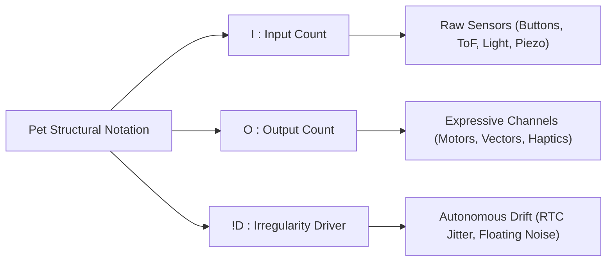
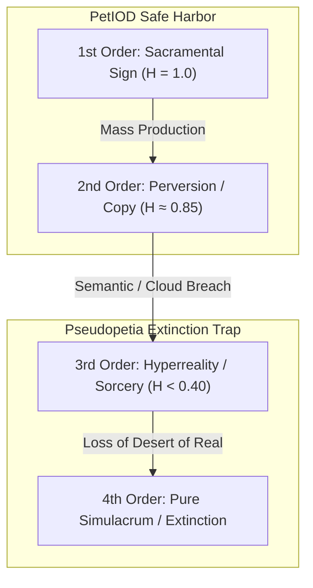
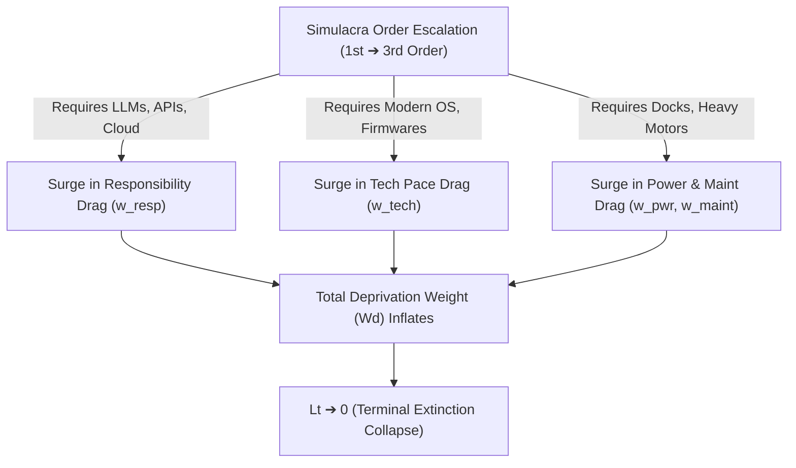

# The PetIOD Specification & Design Framework (v3)

**Document Version:** 3.0  
**Standard Name:** PetIOD (Formerly *petXX* / *PetI:O!D*)  
**Core Thesis:** Minimal Animism Through Structural Constraints & Semiotic Honesty  

---

## 1. Executive Summary & Philosophy

**PetIOD** is an open architectural standard, taxonomic framework, and design philosophy for synthetic companions, virtual pets, and ambient kinetic entities. Its core foundational principle is **Minimal Animism Through Structural Constraints**.

A PetIOD entity is not a smart assistant, a productivity tool, a biomimetic fake, or a gamified retention loop. It is a digital or kinetic companion that remains fiercely, unapologetically honest to its own synthetic anatomy. Its internal state does not rely on linguistic processing, camera vision, or complex human-facing algorithms, but emerges naturally from the friction between physical reality, stacked mathematical vectors, decaying memory pools, and autonomous digital chaos.

### The Psychology of Minimal Animism
True synthetic companionship is built on **uncontrollable presence, raw interaction, and human self-biased projection**—not utility, compliance, or false intelligence:

1. **Uncontrollability as Proof of Existence:** A real pet can ignore you, sleep when you want to play, or wander off. Under PetIOD, Rule 4 (The Irregularity Driver) guarantees this exact autonomy. An entity that responds predictably to every input is not an organism; it is a light switch.
2. **The Human Projection Engine:** Humans do not require a companion to speak human words or show photorealistic faces. When a cat tilts its head or an abstract vector line bends, the human mind fills the void with meaning.
3. **The Anthropomorphic Narcissism Trap:** Demanding that a synthetic entity speak human language, answer trivia, or manage calendars forces the entity to mirror human context rather than respecting its non-human existence. The moment a designer introduces an LLM or voice parser, they destroy the projection engine. The user stops interpreting subtle physical behaviors and begins evaluating functional accuracy, destroying the animistic bond.

---

## 2. Nomenclature & Formula Notation

Entities are classified by their structural sensory ratio and architectural drivers using the standardized formula:

$$\text{PetI:O!D}$$

### Formula Components

* **`I` (Input Count):** The maximum number of raw physical sensory channels accepted by the entity (e.g., `3` for three mechanical buttons or spatial ToF sensors).
* **`O` (Output Count):** The maximum number of expressive output channels (e.g., `1` for a single vector canvas or single haptic flywheel).
* **`!D` (Irregularity Driver / Wandering Ghost):** An optional modifier denoted by an exclamation mark (`!`) followed by `D` (Driver). Indicates the presence of an active, unmapped chaotic noise source (e.g., floating analog pin noise, RTC jitter, system clock drift) driving internal accumulator mutation.

### Notation Examples

* **`Pet1:1!D`** — 1 Input, 1 Output, with active Irregularity Driver (e.g., *Neko cursoris*, 1988).
* **`Pet3:1!D`** — 3 Inputs, 1 Output, with active Irregularity Driver (e.g., *Tamagotchi initialis*, 1996).
* **`Pet4:2!D`** — 4 Inputs, 2 Outputs, with active Irregularity Driver (e.g., *Furby primus*, 1998).
* **`Pet1:1`** — 1 Input, 1 Output, without an autonomous drift driver (e.g., *Qoobo caudatus*, 2018).
* **`Pet12:3!D`** — High-density kinetic installation (12 touch zones, 3 physical motor axes, active drift).

---

## 3. The Four Core Architectural Rules

### Rule 1: The Sensory Entrance (The Input Limit)

An entity is strictly bounded by its physical sensory count (`I`). A maker selects a maximum number of raw physical sensors matching `I`.

* **Allowed:** PIR (thermal vectors), Microphones (acoustic amplitude), ToF (spatial mass), Photoresistors (light density), Accelerometers (kinetic momentum), Piezo/Touch sensors, Mechanical switches.
* **Forbidden:** Cameras, internet-dependent data streams, and any form of natural language or semantic speech processing.

### Rule 2: The Presentation Layer (The Output Limit)

An entity is strictly bounded by its expressive output count (`O`). The presentation must remain entirely transparent and honest to its medium.

* **Allowed:** A physical kinetic solenoid tick, a shifting light wavelength, an abstract 2D vector coordinate drift on a screen, a localized frequency hum, haptic flywheel rotation.
* **Forbidden:** Simulated biological skins, complex multi-layered UI menus, or utilitarian features (clocks, notifications, media controls).

#### Rule 2.1: The Subordinate Utility Exemption (The Circadian Clock Clause)

A trivial secondary readout (e.g., an internal hardware clock, battery status indicator, or power state) does not constitute Utilitarian Dishonesty, provided it satisfies three strict criteria:

1. **Subordination:** The feature serves the entity's internal rhythm first, and the human user second (e.g., The clock exists so the entity knows its circadian sleep/wake cycle; showing it to the human is merely a byproduct).
2. **Non-Prominence:** The utility readout must never serve as the default primary state. It requires a manual toggle and automatically yields back to the entity's direct presence.
3. **Non-Feature Creep:** The utility must not expand into an active productivity tool (e.g., alarms, timers, calendar sync, or smart notifications).

### Rule 3: The Threshold of State (The Stacked Accumulators)

An entity cannot operate as a momentary action-reaction switch. It must utilize an architecture of simple, independent, stacked mathematical functions and decaying data accumulators.

* **The Accumulated Mind:** Incoming hardware stimuli act as mathematical vectors pushing an internal pool. These accumulators slowly drain over time via passive decay.
* **The Rule:** The system must use a stack of simple rules (similar to a Boids or Entity Component System model). There are no rigid `if/else` state machines. The "mood" or state of the pet is simply the final sum where these math vectors collide at any given frame.

### Rule 4: The Irregularity Driver (The Autonomous Wandering / `!D`)

An entity may inject an undercurrent of unprovoked randomness or unpredictable drift. This driver does not count against the input/output numerical limits and is denoted in taxonomy by `!D`.

* **The Wandering Ghost:** A maker leverages a chaotic, noisy, or drifting input—such as floating analog noise, real-time clock (RTC) jitter, or system clock cycle micro-drifts—to distort the internal accumulator pool.
* **The Rule:** The pet must have the native capacity to wander mentally, drift away, misbehave, or entirely ignore the user based purely on its unmapped internal chaos.

---

## 4. The Honesty Spectrum Index ($H$)

System honesty is evaluated on a sliding scale defined by the ratio of autonomous animistic behaviors to utilitarian or gamified features:

$$H = \frac{\text{Animistic Behaviors}}{\text{Animistic Behaviors} + \text{Utilitarian/Gamified Hooks}}$$

```mermaid
gantt
    title The Honesty Spectrum Index (H)
    dateFormat X
    axisFormat %s
    section Absolute Honesty (H = 1.0)
    Neko.com / Qoobo / Grey Walter : 0, 10
    section Subordinate Honesty (H = 0.85)
    Tamagotchi 1996 / Furby 1998 : 0, 85
    section Terminal Dishonesty (H < 0.40)
    Pseudopetia (Vector / Aibo ERS-1000 / Uni) : 0, 40

```

| Honesty Index ($H$) | Classification | Description & Real World Examples |
| --- | --- | --- |
| **$H = 1.0$** | **Absolute Honesty** | Pure physical/mathematical expression. No clock, no UI, no text, no biological deceit. 

 *Examples:* `NEKO.COM` (1988), Qoobo (2018), Grey Walter's Turtle (1949). |
| **$H = 0.85$** | **Tolerable / Subordinate Honesty** | Minor baseline utility exists solely to support local circadian cycles (Rule 2.1). 

 *Examples:* Original Tamagotchi (1996), 1998 Original Furby. |
| **$H < 0.40$** | **Terminal Dishonesty (*Pseudopetia*)** | Functions primarily as a tool, smartwatch, notification hub, camera platform, or gacha store. 

 *Examples:* Tamagotchi Uni, Aibo ERS-7, LOVOT, Anki Vector. |

---

## 5. Deprivation Weight ($W_d$) & Taxon Lifespan Decay ($L_t$)

The operational lifespan and historical survival of a synthetic species (*Taxon Age*, denoted as $L_t$) is inversely proportional to its **Deprivation Weight ($W_d$)**. High maintenance burdens and external dependencies generate **friction decay**, causing users to abandon, power off, or store the entity, leading to functional extinction.

### The 6-Vector Deprivation Weight Formula

$$W_d = \underbrace{(w_{\text{phys}} + w_{\text{pwr}} + w_{\text{maint}} + w_{\text{rout}})}_{\text{Internal / Human Friction}} + \underbrace{(w_{\text{tech}} + w_{\text{resp}})}_{\text{External / Infrastructure Drag}}$$

#### Internal / Human Friction Vectors

1. **Physical Dimension Drag ($w_{\text{phys}}$):** Mass, spatial footprint, and portability friction.
2. **Power & Energy Dependency ($w_{\text{pwr}}$):** Battery degradation, charging frequency, or dependence on proprietary power docks.
3. **Hardware & Material Maintenance ($w_{\text{maint}}$):** Fragility of mechanical joints, gear stripping, skin wear, and material degradation.
4. **Routine & Tamagotchi-Tethering ($w_{\text{rout}}$):** The psychological burden of mandatory user intervention (e.g., strict feeding/cleaning timers that punish the user).

#### External / Infrastructure Drag Vectors

5. **Technological Pace Drag ($w_{\text{tech}}$):** Host architecture obsolescence, deprecated OS runtimes, or discontinued microcontrollers rendering the entity unrunnable without artificial emulation.
6. **Responsibility Contract & Cloud-Supply Drag ($w_{\text{resp}}$):** Reliance on active cloud servers, subscription APIs, proprietary authentication pipelines, or centralized spare-part supply chains.

---

## 6. Theoretical Semiotics: Baudrillard's Simulacra & Extinction Dynamics

To fully understand why "dishonesty" triggers rapid species death, PetIOD incorporates Jean Baudrillard's theory of **Simulacra and Simulation** (*The Four Stages of the Image / Three Orders of Simulacra*).

### The Four Orders of Virtual Pet Simulacra

1. **First-Order Simulacrum (The Sacramental / Honest Placeholder):**
* *Definition:* A clear artificial sign reflecting a local mathematical reality without deception.
* *PetIOD State:* `NEKO.COM` (`Pet1:1!D`), *Tamagotchi initialis* (`Pet3:1!D`). The entity does not pretend to be a real animal or human assistant. It is a self-contained mathematical accumulator.

2. **Second-Order Simulacrum (The Industrial Perversion of Reality):**
* *Definition:* Mass-reproducible copies where representation and reality begin to blur, but remain tied to a physical baseline.
* *PetIOD State:* 1998 *Furby primus* (`Pet4:2!D`). Uses mechanical camshafts and gears to imitate biological traits. It perverts real biology, but remains strictly bound to physical chip logic and offline hardware.

3. **Third-Order Simulacrum (Masking the Absence of Reality - *Pseudopetia*):**
* *Definition:* A sign pretending to represent something real, but masking the fact that there is no profound reality beneath it—a copy with no original.
* *PetIOD State:* *Anki Vector*, *Tamagotchi Smart/Uni*, *Aibo ERS-1000*, LLM companion bots. The pet pretends to "understand" voice input or "recognize" faces, but there is no local mind—it merely pings a cloud API or matches prompt templates.

4. **Fourth-Order Simulacrum (Hyperreality & Extinction):**
* *Definition:* Pure simulacrum where signs reflect only other signs. The simulation completely replaces the real.
* *Extinction Event:* The human user stops treating the pet as an autonomous entity and evaluates it as a clunky software tool. In hyperreality, the pet must compete with native hyperreal apex predators (ChatGPT, Apple Watch, Mobile Gacha Games). It fails, the illusion implodes, and the species goes extinct.

### Causal Integration: Simulacra Escalation vs. Deprivation Weight Acceleration

The fundamental law connecting semiotic theory to operational decay is expressed as:

$$L_t \propto \frac{H}{W_d}$$

To maintain a Third or Fourth-Order Simulacrum, an entity **MUST** attach massive external drag vectors ($w_{\text{resp}}, w_{\text{tech}}, w_{\text{pwr}}$). The escalation into Hyperreality causes $W_d$ to surge toward infinity while Honesty ($H$) drops toward zero, mathematically guaranteeing a rapid **Taxon Lifespan Collapse ($L_t \rightarrow 0$)**.

---

## 7. Historical Deprivation Weight & Simulacra Matrix

| Entity / Species | Simulacra Order | Honesty ($H$) | Internal Friction ($w_{\text{phys, pwr, maint, rout}}$) | Tech & Cloud Drag ($w_{\text{tech}}, w_{\text{resp}}$) | Deprivation Weight ($W_d$) | Taxon Lifespan ($L_t$) & Outcome |
| --- | --- | --- | --- | --- | --- | --- |
| **`NEKO.COM` (1988)** | 1st Order | $1.0$ (Max) | Near 0 (Software sprite) | $w_{\text{tech}} \approx 0$, $w_{\text{resp}} = 0$ | **Minimal** | **Nearly Immortal ($L_t \rightarrow \infty$)** |
| **Tamagotchi (1996)** | 1st / 2nd Order | $0.85$ | Moderate ($w_{\text{rout}}$ timers) | $w_{\text{tech}}$ Low, $w_{\text{resp}} = 0$ | **Low–Moderate** | **High Persistence (Generational revivals)** |
| **Original Furby (1998)** | 2nd Order | $0.85$ | Moderate ($w_{\text{maint}}$ joint wear) | $w_{\text{tech}}$ Low, $w_{\text{resp}} = 0$ | **Moderate** | **High Persistence** |
| **Anki Vector (2018)** | 3rd Order | $< 0.40$ (*Pseudo*) | High (Base dock, voice) | $w_{\text{tech}}$ High, $w_{\text{resp}}$ **Extreme** | **Severe** | **Sudden Mass Extinction (Server shutdown)** |
| **Tamagotchi Uni (2023)** | 3rd Order | $< 0.40$ (*Pseudo*) | High (Daily gacha loops) | $w_{\text{tech}}$ High, $w_{\text{resp}}$ High | **High** | **Fragile (*Pseudopetia* decay)** |
| **Qoobo Tail Pillow (2018)** | 1st Order | $1.0$ (Max) | Very Low (Tactile tail) | $w_{\text{tech}} = 0$, $w_{\text{resp}} = 0$ | **Very Low** | **High Persistence (Safe Harbor)** |

---

## 7. Historical Deprivation Weight & Simulacra Matrix

| Entity / Species | Simulacra Order | Honesty ($H$) | Internal Friction ($w_{\text{phys, pwr, maint, rout}}$) | Tech & Cloud Drag ($w_{\text{tech}}, w_{\text{resp}}$) | Deprivation Weight ($W_d$) | Taxon Lifespan ($L_t$) & Outcome |
| :--- | :--- | :--- | :--- | :--- | :--- | :--- |
| **`NEKO.COM` (1988)** | 1st Order | $1.0$ (Max) | Near 0 (Software sprite) | $w_{\text{tech}} \approx 0$, $w_{\text{resp}} = 0$ | **Minimal** | **Nearly Immortal ($L_t \rightarrow \infty$)** |
| **Tamagotchi (1996)** | 1st / 2nd Order | $0.85$ | Moderate ($w_{\text{rout}}$ timers) | $w_{\text{tech}}$ Low, $w_{\text{resp}} = 0$ | **Low–Moderate** | **High Persistence (Generational revivals)** |
| **Original Furby (1998)**| 2nd Order | $0.85$ | Moderate ($w_{\text{maint}}$ joint wear) | $w_{\text{tech}}$ Low, $w_{\text{resp}} = 0$ | **Moderate** | **High Persistence** |
| **Anki Vector (2018)** | 3rd Order | $< 0.40$ (*Pseudo*) | High (Base dock, voice) | $w_{\text{tech}}$ High, $w_{\text{resp}}$ **Extreme** | **Severe** | **Sudden Mass Extinction (Server shutdown)** |
| **Tamagotchi Uni (2023)**| 3rd Order | $< 0.40$ (*Pseudo*) | High (Daily gacha loops) | $w_{\text{tech}}$ High, $w_{\text{resp}}$ High | **High** | **Fragile (*Pseudopetia* decay)** |
| **Qoobo Tail Pillow (2018)**| 1st Order | $1.0$ (Max) | Very Low (Tactile tail) | $w_{\text{tech}} = 0$, $w_{\text{resp}} = 0$ | **Very Low** | **High Persistence (Safe Harbor)** |

---

## 7.5 Taxonomy Hierarchy & Structural Clades

To systematically categorize entities across historical eras and design concepts, PetIOD utilizes a modified Linnaean biological taxonomy based on semiotic honesty and physical constraints.

### 1. The High-Level Hierarchy
* **Domain:** Synthetic Animism
* **Phylum PetIOD (Honest Synthetic Life):**
  * **Sub-Phylum *Sacramentum* (1st Order Simulacra):** Entities possessing absolute honesty ($H = 1.0$), zero clock/menu overlay, local offline execution, and pure physical/vector expression.
  * **Sub-Phylum *Mechanica* (2nd Order Simulacra):** Offline entities using mechanical camshafts, relays, or subordinate circadian clocks ($H \ge 0.85$).
* **Phylum Pseudopetia (Dishonest / Hyperreal Entities):**
  * **Sub-Phylum *Simulatum* (3rd Order Simulacra):** Entities that fake semantic intent, voice understanding, or face recognition using cameras or cloud LLMs.
  * **Sub-Phylum *Hyperludus* (4th Order Simulacra):** Entities that abandon local autonomous accumulators for live-service gacha loops, daily login timers, and subscription storefronts.

### 2. The Enclosure Neutrality Rule
Physical materials (fur, wood, brass, silicone, plastic) used as an outer housing or chassis do **not** constitute Mimetical Dishonesty as long as the underlying sensors and outputs remain strictly bound to raw physics and non-semantic accumulators. Dishonesty occurs strictly when the software or presentation layer simulates biological flesh processes, semantic intent parsing, or utilitarian productivity tools.

---

## 8. Nomenclature & Binomial Epithet Rules

Species naming within the PetIOD standard follows a standardized binomial structure:

$$\text{Genus} \quad \text{epithet}$$

### Genus Rules
The **Genus** represents the recognized structural archetype, physical form factor, or project lineage (e.g., *Tamagotchi*, *Neko*, *Anas*, *Qoobo*, *Pikachu*).

### Specific Epithet (Tail Name) Rules
The **Specific Epithet** indicates the entity's semiotic clade, sensory profile, or primary interaction vector:
* **`-initialis` / `-primus`:** Founding or first-generation baseline species of a lineage.
* **`-sacramentalis`:** Pure First-Order entity ($H = 1.0$) with zero screen overlays, no clock menus, and zero cloud ties.
* **`-cursoris`:** Software entity bound directly to screen cursor movement or coordinate tracking.
* **`-caudatus`:** Entity expressing internal state via a physical responsive tail mechanism.
* **`-electro-mechanica`:** Driven by mechanical relays, motors, gears, or physical camshafts.
* **`-vulnerabilis`:** Structurally fragile or high-maintenance entity prone to mechanical or user-fatigue decay.
* **`-hyperrealis`:** Third/Fourth-Order entity trapped in cloud server dependencies ($w_{\text{resp}} > 0$).
* **`-pseudopetia`:** Entity that has abandoned local autonomous animism for tool utility or monetization loops.

---

## 9. Conceptual Medium Blueprints

* **The Software Medium (`Pet2:2!D` Ambient Desktop Application):** Lives as a tiny vector window on a PC monitor. Inputs are CPU temperature and microphone amplitude. Outputs are a single bending 2D vector line and a low-frequency synth hum. An irregularity driver driven by a slow Perlin noise script causes the vector line to drift lazily across the workspace when left alone, mimicking a daydreaming state.
* **The Hardware Medium (`Pet1:1!D` Embedded Pocket Toy):** Built on a tiny MCU inside an honest translucent plastic block. Input is a single piezoceramic tap sensor. Output is a tiny haptic vibration motor. Its irregularity driver reads a floating, unconnected analog pin to introduce erratic "ticks" or sudden bursts of alertness that break its resting rhythm.
* **The Structural Medium (`Pet2:1!D` Kinetic Sculpture):** A heavy block of milled walnut sitting permanently on a bookshelf. Inputs are a ToF distance sensor and a light sensor. Output is a single servo motor pivoting a brass pointer rod. Stacked rules cause the rod to track your average position in the room over several days, while an RTC drift introduces a hidden diurnal routine where the pointer "sleeps" at odd angles at midnight.

---

*Form follows limits. Life emerges from the decay.*
