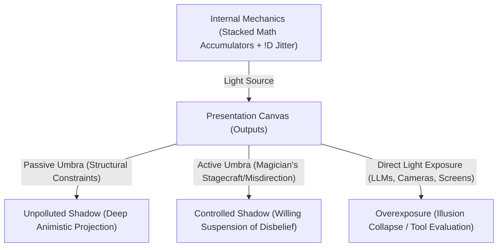
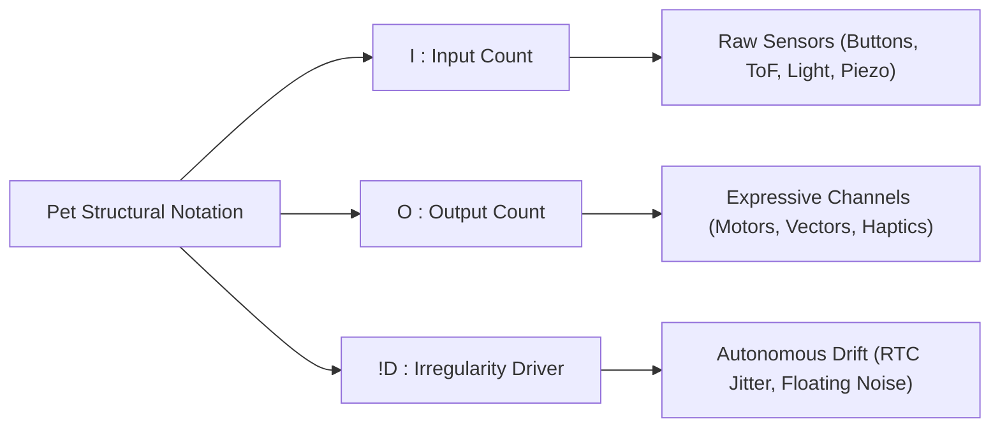
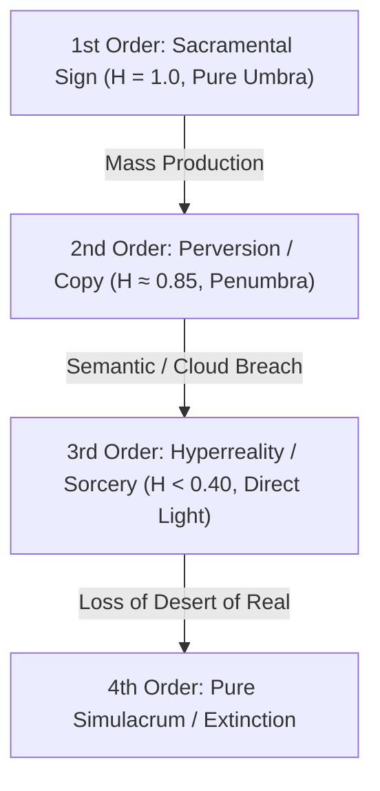

# The PetIOD Specification & Design Framework (v5)

**Document Version:** 5.0  
**Standard Name:** PetIOD (Formerly *petXX* / *PetI:O!D*)  
**Core Thesis:** Minimal Animism Through Structural Constraints, Optical Umbra Projection, and Stagecraft Mechanics  

---

## 1. Executive Summary & Philosophy

**PetIOD** is an open architectural standard, taxonomic framework, and design philosophy for synthetic companions, virtual pets, and ambient kinetic entities. Its core foundational principle is **Minimal Animism Through Structural Constraints**.

A PetIOD entity is not a smart assistant, a productivity tool, a biomimetic fake, or a gamified retention loop. It is a digital or kinetic companion that remains fiercely, unapologetically honest to its own synthetic anatomy. Its internal state does not rely on linguistic processing, camera vision, or complex human-facing algorithms, but emerges naturally from the friction between physical reality, stacked mathematical vectors, decaying memory pools, and autonomous digital chaos.

### The Psychology of Minimal Animism
True synthetic companionship is built on **uncontrollable presence, raw interaction, and human self-biased projection**—not utility, compliance, or false intelligence:

1. **Uncontrollability as Proof of Existence:** A real pet can ignore you, sleep when you want to play, or wander off. Under PetIOD, Rule 4 (The Irregularity Driver) guarantees this exact autonomy. An entity that responds predictably to every input is not an organism; it is a light switch.
2. **The Human Projection Engine:** Humans do not require a companion to speak human words or show photorealistic faces. When a cat tilts its head or an abstract vector line bends, the human mind fills the void with meaning.
3. **The Anthropomorphic Narcissism Trap:** Demanding that a synthetic entity speak human language, answer trivia, or manage calendars forces the entity to mirror human context rather than respecting its non-human existence. The moment a designer introduces an LLM or voice parser, they destroy the projection engine. The user stops interpreting subtle physical behaviors and begins evaluating functional accuracy, destroying the animistic bond.

---

## 2. Theoretical Optics: Umbra, Penumbra, Stagecraft & Exposure

The cognitive mechanism of human animism is formally defined through an integration of **Plato's Allegory of the Cave, shadow puppetry, stage magic (mentalism), and cinematographic exposure**.

### 2.1 The Shadow Canvas: Passive vs. Active Umbra

The perceived bond between a human and a synthetic entity relies on **Umbra**—the functional negative space where interface constraints prevent explicit semantic exposure, forcing the human mind to project animistic life into the shadow.

1. **Passive Umbra (Structural Constraint & Omission):** The shadow canvas created purely by **omission and strict hardware limits** (e.g., *Neko cursoris*, *Qoobo caudatus*). By omitting screens, voice parsers, and text UI, the interface casts an unpolluted shadow ($I_e \approx 0$), maximizing human imaginative projection.
2. **Active Umbra (The Magician's Misdirection & Stagecraft):** The shadow canvas created through **deliberate design misdirection, behavioral timing, and mentalist tricks**:
* *Acoustic Misdirection:* Using pitch shifts or chirps instead of words (*Furby*, *Nicobo*). The user "hears" emotion, but no semantic parsing occurred.
* *Kinetic Gaze Tracking:* Pivoting a head assembly toward a sound threshold using raw ToF amplitudes. The user perceives "curiosity."
* *Temporal Irregularity (`!D`):* Injecting 1.5–2.0 second hesitation delays before reacting. Immediate response feels like a switch; delayed response feels like "deliberation."

3. **The Penumbra (The Blur of Liminal Compromise):** The partial, fuzzy shadow surrounding the Umbra. Represents minor non-semantic features (subordinate circadian clocks, localized mechanical chirps). The edges of the illusion blur, but the core animistic bond remains intact if kept offline ($w_{\text{resp}} = 0$).
4. **Antumbra & Direct Light (Hyperreal Exposure):** When a designer introduces direct language generation (LLMs), biometric cameras, or photorealistic biological skins, they shine direct, blinding light onto the canvas ($I_e \rightarrow \infty$). The shadow dissolves. The user becomes a critic testing a tool, destroying the animistic bond.

### 2.2 The Inverse-Square Law of Exposure ($I_e$)

In cinematography and optics, light intensity drops off with the square of the distance. In PetIOD, as an entity approaches **Explicit Realism or Utilitarian Features ($R$)**, the **Exposure Intensity ($I_e$)** hitting user perception behaves as an inverse-square function of the distance from explicit realism ($d_R$):

$$I_e = \frac{K}{(d_R)^2}$$

$$\text{Perceived Animistic Bond} \propto \frac{\text{Umbra Factor}(U)}{I_e}$$

* As $d_R \rightarrow \infty$ (Far from explicit realism/utility), Exposure drops ($I_e \rightarrow 0$), leaving a deep, high-contrast **Passive/Active Umbra ($U \rightarrow 1.0$)** where human projection thrives.
* As $d_R \rightarrow 0$ (Close to explicit realism/utility), Exposure surges ($I_e \rightarrow \infty$), blinding the projection engine, dissolving the Umbra, and accelerating species death.

---

## 3. Nomenclature & Formula Notation

Entities are classified by their structural sensory ratio and architectural drivers using the standardized formula:

$$\text{PetI:O!D}$$

### Formula Components

* **`I` (Input Count):** The maximum number of raw physical sensory channels accepted by the entity (e.g., `3` for three mechanical buttons or spatial ToF sensors).
* **`O` (Output Count):** The maximum number of expressive output channels (e.g., `1` for a single vector canvas or single haptic flywheel).
* **`!D` (Irregularity Driver / Wandering Ghost):** An optional modifier denoted by an exclamation mark (`!`) followed by `D` (Driver). Indicates the presence of an active, unmapped chaotic noise source (e.g., floating analog pin noise, RTC jitter, system clock drift) driving internal accumulator mutation.

### Notation Examples

* **`Pet1:1!D`** — 1 Input, 1 Output, with active Irregularity Driver (e.g., *Neko cursoris*, 1988).
* **`Pet3:1!D`** — 3 Inputs, 1 Output, with active Irregularity Driver (e.g., *Tamagotchi initialis*, 1996).
* **`Pet4:2!D`** — 4 Inputs, 2 Outputs, with active Irregularity Driver (e.g., *Furby primus*, 1998).
* **`Pet1:1`** — 1 Input, 1 Output, without an autonomous drift driver (e.g., *Qoobo caudatus*, 2018).

---

## 4. The Four Core Architectural Rules

### Rule 1: The Sensory Entrance (The Input Limit)

An entity is strictly bounded by its physical sensory count (`I`). A maker selects a maximum number of raw physical sensors matching `I`.

* **Allowed:** PIR (thermal vectors), Microphones (acoustic amplitude), ToF (spatial mass), Photoresistors (light density), Accelerometers (kinetic momentum), Piezo/Touch sensors, Mechanical switches.
* **Forbidden:** Cameras, internet-dependent data streams, and any form of natural language or semantic speech processing.

#### Rule 1.1: The Alleged Transgression Clause (Signal vs. Semantics)

A sensory channel that processes non-semantic physical signal properties does not constitute a semantic breach.

1. **Allowed Non-Semantic Signals:** Acoustic pitch tracking (frequency peaks, clapping, whistle pitch thresholds), proximity spatial blob detection (IR spatial mass without facial mapping), and kinetic momentum (accelerometer impact velocity).
2. **Forbidden Semantic Transgressions:** Speech-to-text parsing, keyword recognition, facial biometric identification, emotional expression classification, or cloud-based sentiment analysis.

### Rule 2: The Presentation Layer (The Output Limit)

An entity is strictly bounded by its expressive output count (`O`). The presentation must remain entirely transparent and honest to its medium.

* **Allowed:** A physical kinetic solenoid tick, a shifting light wavelength, an abstract 2D vector coordinate drift on a screen, a localized frequency hum, haptic flywheel rotation.
* **Forbidden:** Simulated biological skins, complex multi-layered UI menus, or utilitarian features (clocks, notifications, media controls).

#### Rule 2.1: The Subordinate Utility Exemption (The Circadian Clock Clause)

A trivial secondary readout (e.g., an internal hardware clock, battery status indicator, or power state) does not constitute Utilitarian Dishonesty, provided it satisfies three strict criteria:

1. **Subordination:** The feature serves the entity's internal rhythm first, and the human user second.
2. **Non-Prominence:** The utility readout must never serve as the default primary state.
3. **Non-Feature Creep:** The utility must not expand into an active productivity tool.

### Rule 3: The Threshold of State (The Stacked Accumulators)

An entity cannot operate as a momentary action-reaction switch. It must utilize an architecture of simple, independent, stacked mathematical functions and decaying data accumulators.

### Rule 4: The Irregularity Driver (The Autonomous Wandering / `!D`)

An entity may inject an undercurrent of unprovoked randomness or unpredictable drift. This driver does not count against input/output limits and is denoted in taxonomy by `!D`.

---

## 5. The Honesty Spectrum Index ($H$)

System honesty is evaluated on a sliding scale defined by the ratio of autonomous animistic behaviors to utilitarian or gamified features:

$$H = \frac{\text{Animistic Behaviors}}{\text{Animistic Behaviors} + \text{Utilitarian/Gamified Hooks}}$$

| Honesty Index ($H$) | Classification | Description & Real World Examples |
| --- | --- | --- |
| **$H = 1.0$** | **Absolute Honesty (Pure Umbra)** | Pure physical/mathematical expression. No clock, no UI, no text, no biological deceit. 

 *Examples:* `NEKO.COM` (1988), Qoobo (2018), Grey Walter's Turtle (1949). |
| **$H = 0.85$** | **Tolerable Honesty (Penumbra)** | Minor baseline utility exists solely to support local circadian cycles (Rule 2.1). 

 *Examples:* Original Tamagotchi (1996), 1998 Original Furby. |
| **$H < 0.40$** | **Terminal Dishonesty (*Pseudopetia*)** | Functions primarily as a tool, smartwatch, notification hub, camera platform, or gacha store. 

 *Examples:* Tamagotchi Uni, Aibo ERS-7, LOVOT, Anki Vector. |

---

## 6. Deprivation Weight ($W_d$) & Utility Expectation Metrics

The operational lifespan and historical survival of a synthetic species (*Taxon Age*, denoted as $L_t$) is inversely proportional to its **Deprivation Weight ($W_d$)**, modulated by the **Expectation Performance Ratio ($E$)** and **Exposure Intensity ($I_e$)**:

$$W_d = (w_{\text{phys}} + w_{\text{pwr}} + w_{\text{maint}} + w_{\text{rout}}) + \frac{I_e}{E} (w_{\text{tech}} + w_{\text{resp}})$$

### The Expectation Performance Equation

$$E = \frac{\alpha \cdot T_{\text{era}}}{U_s}$$

1. **Promised Utility Scope ($U_s \ge 1$):** A discrete count of utility/smart features promised to or expected by the user ($U_s = \sum \text{Utility Features}$). For pure PetIOD entities ($H = 1.0$), $U_s = 0$ and $E$ is non-applicable.
2. **Historical Era Tech Baseline ($T_{\text{era}}$):** A qualitative benchmark assigned on a bounded continuous scale of $[0.1, 1.0]$ representing state-of-the-art technology at release ($0.1–0.3$ for 1980s microcontrollers; $0.7–1.0$ for 2020s modern edge NPUs/LLMs).
3. **Subjective Ability Coefficient ($\alpha$):** A human-evaluated performance score assigned on a bounded continuous scale of $[-1.0, 1.0]$:
* **$\alpha = 1.0$ (Flawless Execution):** Features work seamlessly without failure.
* **$\alpha = 0.0$ (Barely Functional):** Unreliable voice parsing, frequent dropouts.
* **$\alpha < 0.0$ (Destructive Execution, $[-1.0, -0.1]$):** Active failure causing user frustration, crashes, or bricking.

---

## 7. Theoretical Semiotics: Baudrillard's Simulacra & Extinction Dynamics

### The Four Orders of Virtual Pet Simulacra

1. **First-Order Simulacrum (Sacramental / Honest Placeholder):** `NEKO.COM`, *Tamagotchi initialis*. Pure self-contained math accumulators ($H = 1.0, w_{\text{resp}} = 0$).
2. **Second-Order Simulacrum (Industrial Perversion):** 1998 *Furby primus*. Offline camshafts and microcontrollers ($H \ge 0.85$).
3. **Third-Order Simulacrum (Masking Absence of Reality - *Pseudopetia*):** *Anki Vector*, *Aibo ERS-1000*. Fakes language/faces via cloud APIs.
4. **Fourth-Order Simulacrum (Hyperreality & Extinction):** User evaluates device as a clunky tool, triggering immediate species death ($L_t \rightarrow 0$).

---

## 8. Taxonomy Hierarchy & Structural Clades

* **Domain:** Synthetic Animism
* **Phylum PetIOD (Honest Synthetic Life):**
* **Sub-Phylum *Sacramentum* (1st Order Simulacra):** Absolute honesty ($H = 1.0$), pure Umbra, local offline execution.
* **Sub-Phylum *Mechanica* (2nd Order Simulacra):** Offline entities using mechanical camshafts, relays, or subordinate circadian clocks ($H \ge 0.85$).

* **Phylum Pseudopetia (Dishonest / Hyperreal Entities):**
* **Class I: *Pseudo-allegata* (Alleged Transgression):** Local non-semantic pitch tracking, subordinate clocks ($w_{\text{resp}} = 0$).
* **Class II: *Pseudo-mimetica* (Mimetical Deceit):** Offline entities simulating biological flesh, faces, or scripted dialogue trees.
* **Class III: *Pseudo-terminalis* (Systemic Cloud / Live-Service Trap):** Cloud LLMs, camera facial recognition, gacha monetization ($w_{\text{resp}} > 0$).

---

## 9. Nomenclature & Binomial Epithet Rules

$$\text{Genus} \quad \text{epithet}$$

### Specific Epithet (Tail Name) Lexicon

* **`-initialis` / `-primus`:** Founding baseline species.
* **`-sacramentalis`:** Pure First-Order entity ($H = 1.0$, zero screens/cloud).
* **`-cursoris`:** Screen sprite bound to cursor coordinates.
* **`-caudatus`:** Physical responsive tail mechanism.
* **`-electro-mechanica`:** Motor, relay, or camshaft automaton.
* **`-psittacis`:** Parroting entity using Large Language Models (LLMs) or generative natural language synthesis.
* **`-vinculatus`:** Tethered or leashed entity requiring cloud infrastructure, remote APIs, or active Wi-Fi pipelines ($w_{\text{resp}} > 0$).
* **`-psittacis vinculatus`:** Combined designation for cloud-tethered LLM entities (e.g., cloud conversational bots).
* **`-vulnerabilis`:** Structurally fragile or high-maintenance entity prone to mechanical joint wear or decay.
* **`-pseudopetia`:** Entity that has abandoned local autonomous animism for tool utility or monetization loops.
* **`-ambiens`:** Low-maintenance ambient background companion.

---

*Form follows limits. Life emerges from the decay.*
