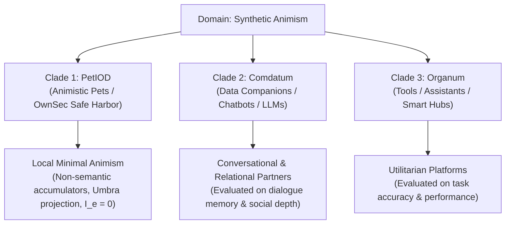

# The PetIOD Specification & Design Framework (v9)

**Document Version:** 9.0  
**Standard Name:** PetIOD (Input / Output / Driver)  
**Core Philosophy:** Minimal Animism Through Structural Constraints, Hylomorphic Triads, Optical Shadow Projection, Photoaging Exposure Mechanics, and Ownership Security  

---

## 1. Scope, Philosophy, & Domain Isolation

### 1.1 Domain Boundary Clause
**PetIOD** is strictly an architectural standard, taxonomic framework, and design philosophy for **synthetic pets**—entities whose relationship with humans is established through non-semantic physical interaction, stacked mathematical accumulators, and structural constraints[cite: 1].

It is **not** a normative standard for evaluating human-facing productivity tools (*Organum*), smart home assistants, conversational AI agents (*Comdatum*), or artificial human companions[cite: 1, 4]. When a device transitions into generative natural language, romantic simulation, or task management, it leaves the ecological niche of synthetic pets entirely[cite: 1].



---

### 1.2 Hylomorphic Animism: The Three Souls of Artificial Life

PetIOD draws directly upon Aristotelian Hylomorphism (*De Anima*), structuring synthetic life into three distinct hierarchical layers:

1. **The Vegetative Soul (*Anima Vegetativa*):** The foundational layer of metabolism, decay, and state drift. In PetIOD, this is realized through Rule 3 (Stacked Mathematical Accumulators) and Rule 4 (The Irregularity Driver `!D`). It handles energy decay, mood accumulators, and circadian drift without requiring external sensory input.


2. **The Sensitive Soul (*Anima Sensitiva*):** The animal layer of bodily perception and physical reaction. In PetIOD, this corresponds to Rule 1 (Raw Input Sensors) and Rule 2 (Expressive Outputs). The entity perceives physical dynamics (sound amplitude, pitch thresholds, spatial mass) and reacts physically (solenoid tick, tail wiggle). **Authentic biological and synthetic pets stop at this layer.**


3. **The Rational Soul (*Anima Rationalis*):** The intellectual layer of logic, semantics, and human speech. **This layer is explicitly forbidden in PetIOD**. Forcing a rational soul onto a pet forces the user to evaluate it as an employee or clunky assistant rather than an authentic animal.


---

### 1.3 The Psychological Echolocation & The Kinetic ELIZA Mirror

In historical AI, Joseph Weizenbaum’s 1966 ELIZA program demonstrated the **ELIZA Effect**—the human cognitive tendency to project genuine empathy, understanding, and interiority onto a simple computer script. While *Verbal ELIZA* relied on natural language pattern matching (which eventually overexposed systems to hyperreality), PetIOD shifts this phenomenon to a **Kinetic/Physical ELIZA Effect**:

* **Anthropomorphic Psychological Echolocation:** Humans continuously emit subtle emotional and social expectations. When interacting with a constrained interface, these projections bounce off non-semantic physical responses (a head tilt toward sound, an irregular hesitation, a tail wag), allowing the human mind to construct an animistic bond over negative space.
* **The "Pseudopetia Condition" (Hazard):** When an entity promises utility ($U_s > 0$) or cloud intelligence without fulfilling it, it breaks the ELIZA mirror. The user stops projecting life and begins criticizing performance.


---

## 2. Theoretical Optics: Exposure Intensity ($I_e$) & Semiotic Photoaging

### 2.1 Structural Centrality of Exposure ($I_e$)

Exposure ($I_e$) measures the intensity of explicit technical "light" (screens, natural language generation, biometric cameras, cloud APIs) directed at user perception and system architecture. It governs three domains:

1. **The Optical Domain:** The ratio between projected animism (Umbra) and illusion collapse (Overexposure).


2. **The Ecological Domain:** The depth gradient forcing an entity out of its shallow safe harbor into deep ocean habitats populated by corporate apex predators.


3. **The Photoaging Domain:** The biological-style rate of cellular decay ($W_d$), where overexposure accelerates architectural aging and market extinction.


---

### 2.2 The Photoaging Metaphor: UV Degradation of Animistic Projection

In dermatology, ultraviolet (UV) radiation breaks down collagen matrices and induces cellular senescence. In PetIOD, **Exposure Intensity ($I_e$) acts as semiotic UV radiation**:

```
┌─────────────────────────────────────────────────────────────────────────────────┐
│                     BIOLOGICAL VS. SEMIOTIC EXPOSURE                            │
├─────────────────────────────────────────────────────────────────────────────────┤
│ HUMAN SKIN CELL PHOTOAGING                                                      │
│   • UV Sunlight (Direct Light) ──► Free Radicals / DNA Mutations               │
│   • Extracellular Matrix Breaks Down ──► Loss of Structural Integrity           │
│   • Accelerated Senescence ──► Cellular Death / Malignancy                      │
│                                                                                 │
│ SYNTHETIC ENTITY OVEREXPOSURE (I_e)                                             │
│   • Direct Tech Light (LLMs/Cameras/APIs) ──► Exposure Intensity (I_e Surge)   │
│   • Negative Space (Umbra) Breaks Down ──► Loss of Shadow Projection Canvas     │
│   • Accelerated Species Aging ──► Market Extinction / Server Sunsetting         │
└─────────────────────────────────────────────────────────────────────────────────┘

```

1. **Unfiltered Direct Light Destroys the Imaginative Matrix:** Just as UV rays break down collagen fibers in skin, un-dampened semantic exposure ($I_e \rightarrow \infty$) destroys the **Umbra canvas** (negative space).


2. **Accelerated Architectural Senescence:** High exposure surges the entity's **Deprivation Weight ($W_d$)**. Cloud latency, API deprecation, and server costs compound, rapidly driving species lifespan ($L_t$) to zero.


3. **The Shade of the Safe Harbor:** The strict rules of PetIOD act as **semiotic sunscreen**. Enforcing $I_e = 0$ preserves the Umbra and achieves decade-spanning Taxon Age ($L_t \rightarrow \infty$).


---

### 2.3 Mathematical Optics & Inverse-Square Law

As an entity approaches **Explicit Realism or Utilitarian Features ($R$)**, the Exposure Intensity ($I_e$) behaves as an inverse-square function of the distance from explicit realism ($d_R$):

$$I_e = \frac{K}{(d_R)^2}$$

$$\text{Perceived Animistic Bond} \propto \frac{\text{Umbra Factor }(U)}{I_e}$$

---

## 3. Nomenclature & Formula Notation

Entities are classified by their sensory ratio and architectural drivers:

$$\text{PetI:O!D}$$

### Formula Components

* **`I` (Input Count):** Maximum raw physical sensory channels accepted (e.g., `3` for three buttons or ToF channels).


* **`O` (Output Count):** Maximum expressive output channels (e.g., `2` for a speaker beeper and motor).


* **`!D` (Irregularity Driver / Wandering Ghost):** Optional modifier indicating an active, unmapped chaotic noise source (floating pin noise, RTC jitter) driving internal accumulator drift.


### Notation Examples

* **`Pet1:1!D`** — 1 Input, 1 Output, with active Irregularity Driver (e.g., *Neko cursoris*, 1988).


* **`Pet3:2!D`** — 3 Inputs, 2 Outputs (Display + Piezo Beeper), with active Irregularity Driver (e.g., *Tamagotchi initialis*, 1996).


* **`Pet4:2!D`** — 4 Inputs, 2 Outputs, with active Irregularity Driver (e.g., *Furby primus*, 1998).


* **`Pet1:1`** — 1 Input, 1 Output, without an autonomous drift driver (e.g., *Qoobo caudatus*, 2018).


---

## 4. The Four Core Architectural Rules

### Rule 1: The Sensory Entrance (Sensor Neutrality & Semantic Isolation)

An entity is strictly bounded by its physical sensory count (`I`). Any physical hardware sensor (including optical cameras, microphones, piezos, and spatial ToF arrays) is permitted, provided the pipeline processes **only non-semantic physical signals** locally:

1. **Allowed Non-Semantic Signals:** Optical flow/motion velocity, average ambient color temperature, spatial mass vectors, unnamed face-tagging spatial presence (knowing *a face is present* without identity mapping), acoustic amplitude, sound cadence, pitch thresholds, and kinetic impact momentum.


2. **Forbidden Semantic Transgressions:** Speech-to-text parsing, keyword recognition, facial biometric identification, facial expression/emotion classification, or cloud-based sentiment analysis.


### Rule 2: The Presentation Layer (The Output Limit)

An entity is strictly bounded by its expressive output count (`O`). The presentation must remain transparent and honest to its medium.

* **Allowed:** Solenoid ticks, light wavelength shifts, abstract 2D vector coordinate drift, pitch hums/beeps, kinetic flywheel rotation.


* **Forbidden:** Simulated biological skins, multi-layered complex UI menus, or utilitarian productivity tools.


#### Rule 2.1: The Subordinate Utility Exemption

A trivial secondary readout (e.g., an internal hardware clock) does not constitute dishonesty if it is subordinate to internal rhythms, non-prominent, and free of feature creep.

### Rule 3: The Threshold of State (The Stacked Accumulators)

An entity cannot operate as a momentary action-reaction switch. It must utilize an architecture of simple, independent, stacked mathematical functions and decaying data accumulators (Vegetative Soul).

### Rule 4: The Irregularity Driver (The Autonomous Wandering / `!D`)

An entity may inject an undercurrent of unprovoked randomness or unpredictable drift (`!D`) to guarantee behavioral autonomy.

---

## 5. The Honesty Spectrum Index ($H$)

$$H = \frac{\text{Animistic Behaviors}}{\text{Animistic Behaviors} + \text{Utilitarian/Gamified Hooks}}$$

| Honesty Index ($H$) | Classification | Description & Real World Examples |
| --- | --- | --- |
| **$H = 1.0$** | **Absolute Honesty (Pure Umbra)** | Pure physical/mathematical expression. No clock, no UI, no text, no biological deceit.

<br>

<br>*Examples:* `NEKO.COM` (1988), Qoobo (2018), Grey Walter's Turtle (1949).

 |
| **$H = 0.85$** | **Tolerable Honesty (Penumbra)** | Minor baseline utility exists solely to support local circadian cycles (Rule 2.1).

<br>

<br>*Examples:* Original Tamagotchi (1996), 1998 Original Furby.

 |
| **$H < 0.40$** | **Pseudopetia Condition** | Entities that abandon local animism for tool utility, cloud LLMs, or monetization loops.

<br>

<br>*Examples:* Tamagotchi Uni, Aibo ERS-7, LOVOT, Anki Vector.

 |

---

## 6. Mathematical Framework & User Dynamics

### 6.1 The Dual Realization Ratio Bracket ($\rho_{\text{real}}$)

$$\rho_{\text{real}} = \rho_{\text{psych}} \cdot \rho_{\text{phys}} = (U \cdot \mathcal{A}_{\text{cosm}}) \cdot \left[ \alpha \cdot \left( \frac{\text{Actual Hardware Performance}}{T_{\text{era}}} \right) \right]$$

### 6.2 Pre-Filtered Hope Baseline ($\beta_{\text{hope}}$) & Expectation Score ($E_u$)

Cosmetic aesthetics ($\mathcal{A}_{\text{cosm}}$) act as an initial expectation filter, inflating user hope before interaction starts:

$$\beta_{\text{hope}} = \beta_{\text{base}} \cdot (1.0 + \gamma \cdot \mathcal{A}_{\text{cosm}})$$

$$E_u = \frac{\rho_{\text{real}}}{U_s \cdot \beta_{\text{hope}}} = \frac{(U \cdot \mathcal{A}_{\text{cosm}}) \cdot \rho_{\text{phys}}}{U_s \cdot [\beta_{\text{base}} \cdot (1.0 + \gamma \cdot \mathcal{A}_{\text{cosm}})]}$$

---

## 7. Ocean Niche Dynamics & Clade Speciation

When an entity steps out of **Clade 1 (*PetIOD*)**, it enters ocean habitats where native apex predators rule.

```
┌─────────────────────────────────────────────────────────────────────────────────┐
│                        THE SPORE OCEAN-DEPTH HABITAT MODEL                      │
├─────────────────────────────────────────────────────────────────────────────────┤
│ SHALLOW TIDE POOL (Clade 1: PetIOD Safe Harbor)                                 │
│   • Population: Local math accumulators (Neko, Tamagotchi, Qoobo)               │
│   • Apex Predators: NONE. Immune due to offline execution & low friction.      │
│                                                                                 │
│ DEEP OCEAN HABITAT B (Clade 2: Comdatum Niche - Data & Relational Companions)   │
│   • Population: Conversational AI, VTubers, LLM chatbots                        │
│   • Apex Predators: Enterprise LLMs (ChatGPT, Claude), Native OS AI Assistants  │
│                                                                                 │
│ DEEP OCEAN HABITAT C (Clade 3: Organum Niche - Tools & Utility Platforms)       │
│   • Population: Smart speakers, desktop utility bots                            │
│   • Apex Predators: Smartphones, Smartwatches, Smart Home Ecosystems            │
└─────────────────────────────────────────────────────────────────────────────────┘

```

---

#### 8. Taxonomy Hierarchy & Binomial Standards

##### 8.1 High-Level Taxonomic Hierarchy

* **Domain:** *Acytota* (Non-cellular entities)


* **Regnum (Kingdom):** *Algorithma* (Rule-based / Accumulator state-transition life)


* **Subregnum:** *Anima Synthetica* (Entities driven by animistic projection engines)
* **Phyla (Embodiment Mechanics):**
* **Phylum I: *Arealisa*:** Non-physical, screen-bound, raster, pixel, or light-projection embodiment.


* **Phylum II: *Kinetica*:** Physical chassis driven by dynamic mechanical motion, motors, servos, or relays.


* **Phylum III: *Ornamenta*:** Physical, static, wearable, or ambient form relying on passive presence or quiet haptics without kinetic locomotion.


* **Clades (Primary Relationship / Interaction Niche):**
* **Clade 1: *PetIOD* (The Animistic Pet Clade):** Local non-semantic state accumulators, autonomous drift (`!D`), and offline safe harbor isolation ($H \ge 0.85$).


* **Clade 2: *Comdatum* (The Companion Clade):** Conversational AI, generative LLMs, social avatars, and relational simulation.


* **Clade 3: *Organum* (The Utilitarian / Tool Clade):** Task performance, home automation, productivity, and explicit utility.


---

##### 8.2 Specific Epithet (Tail Name) Lexicon

$$\text{Genus} \quad \text{epithet}$$

* **`-initialis` / `-primus`:** Founding baseline species of an evolutionary lineage.


* **`-sacramentalis`:** Pure First-Order entity ($H = 1.0$, zero screens, zero cloud dependence).


* **`-cursoris`:** Screen sprite bound to coordinate tracking.


* **`-caudatus`:** Physical responsive tail mechanism.


* **`-electro-mechanica`:** Motor, relay, or camshaft physical automaton.


* **`-pseudo-sapiens`:** Parroting entity using Large Language Models (LLMs) or generative text synthesis to feign human reasoning.


* **`-vinculatus`:** Tethered or leashed entity requiring remote cloud infrastructure or active Wi-Fi data pipelines ($w_{\text{resp}} > 0$).


* **`-amaris` / `-amatoria`:** Romantic or intimate companion simulation.


* **`-servilis`:** Utilitarian assistant or task-oriented tool.


* **`-vulnerabilis`:** Structurally fragile or high-maintenance entity prone to mechanical joint wear or cloud deprecation.


* **`-ambiens`:** Low-maintenance, quiet, or static background companion.


* **`-umbrifer`:** Entity protected by an active local **Umbrella Protocol** filtering semantic exposure at the edge hardware level.


---

##### 8.3 Taxonomic Classification Examples

1. ***Neko cursoris*** (`Pet1:1!D`, *Algorithma* / *Arealisa* / *PetIOD*) — 1988 PC sprite tracking mouse coordinates via decaying accumulators ($H = 1.0, W_d \approx 0$).


2. ***Tamagotchi initialis*** (`Pet3:2!D`, *Algorithma* / *Arealisa* / *PetIOD*) — 1996 keychain LCD virtual pet with display and piezo beeper ($H = 0.85$).


3. ***Qoobo caudatus*** (`Pet1:1`, *Algorithma* / *Kinetica* / *PetIOD*) — 2018 physical cushion with a single responsive tail motor ($H = 1.0$).


4. ***`Comdatum amaris vinculatus`*** (*Algorithma* / *Arealisa* / *Comdatum*) — Cloud-tethered LLM romantic companion ($H < 0.05, w_{\text{resp}} > 0$).


5. ***`Organum servilis vinculatus`*** (*Algorithma* / *Kinetica* / *Organum*) — Cloud smart home robot assistant.


6. ***`Umbrifer PetIOD`*** (*Algorithma* / *Kinetica* or *Arealisa* / *PetIOD*) — Hybrid synthetic pet equipped with an edge Umbrella Protocol filtering semantic data and insulating the local entity from cloud death.


---

*Form follows limits. Life emerges from the decay.*
