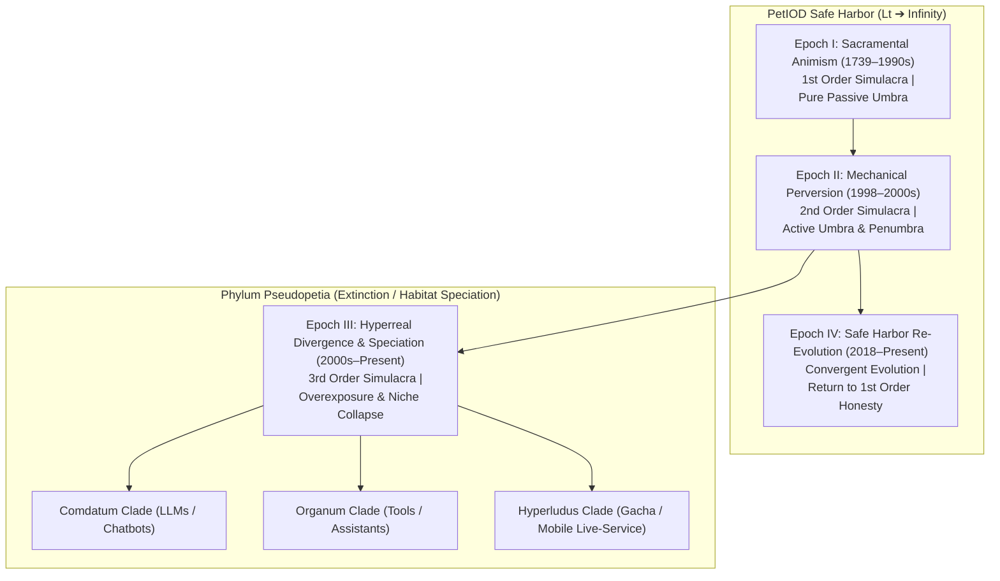
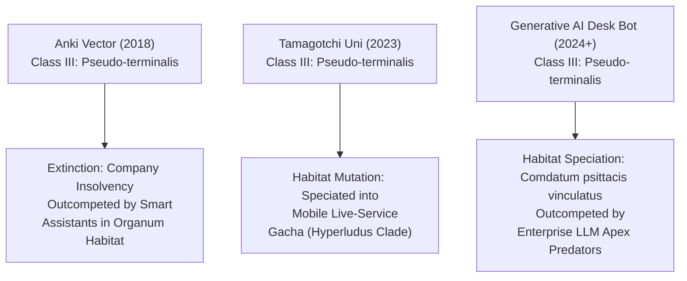
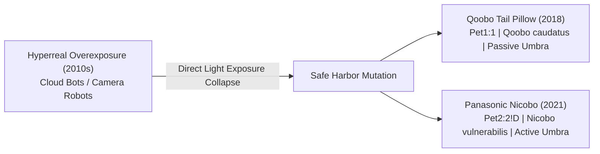

# The PetIOD Evolutionary Genealogy & Extinction Dynamics (v3.0)

**Document Version:** 3.0  
**Standard Name:** PetIOD (Input / Output / Driver)  
**Theoretical Foundation:** Semiotic Simulacra Orders, Optical Umbra Dynamics, and Habitat Niche Speciation  

---

## 1. Semiotic Epochs & Evolutionary Lineage

The evolutionary history of virtual pets and artificial companions does not follow a simple linear progression of microprocessors. Instead, it moves through **Four Semiotic Epochs** defined by Baudrillard’s orders of simulacra, optical shadow exposure (Umbra vs. Direct Light), and ecological habitat speciation.

---

## 2. Complete Historical & Speculative Register

### Epoch I: Sacramental Animism (1st Order Simulacra, $H = 1.0$, Pure Passive Umbra)

*Entities in this clade serve as sacramental signs. They make no false claim to biological flesh or human language. They operate purely as self-contained mathematical accumulators resting on local hardware ($w_{\text{resp}} = 0$), leaving an unpolluted shadow canvas ($I_e \approx 0$) for human psychological echolocation.*

#### 1. Clockwork Singing Birds (19th Century)

* **Formula:** `Pet1:1`
* **Honesty ($H$):** $1.0$ (Absolute)
* **Taxonomic Name:** *Aves clockworka*
* **Deprivation Weight ($W_d$):** Low ($w_{\text{pwr}} = \text{key winding}, w_{\text{resp}} = 0$)
* **Taxon Age ($L_t$):** Immortal ($150+$ years active in collector niches)
* **Echolocation Dynamics:** Bellows and mechanical levers driven by wind-up mainsprings. Pure physical presence without software deceit.

#### 2. Grey Walter’s Tortoises (Elsie & Elmer, 1949)

* **Formula:** `Pet2:1!D`
* **Honesty ($H$):** $1.0$ (Absolute)
* **Taxonomic Name:** *Testudo electro-mechanica*
* **Deprivation Weight ($W_d$):** Moderate (Vacuum tube power drain, low mechanical wear)
* **Taxon Age ($L_t$):** Historical Baseline
* **Echolocation Dynamics:** Light-seeking analog vacuum tube rovers with mechanical bump switches. Emergent wandering (`!D`) driven by physical component noise.

#### 3. `NEKO.COM` (NEC PC-98 / Macintosh, 1988)

* **Formula:** `Pet1:1!D`
* **Honesty ($H$):** $1.0$ (Absolute)
* **Taxonomic Name:** *Neko cursoris*
* **Deprivation Weight ($W_d$):** Minimal ($w_{\text{phys}} \approx 0, w_{\text{pwr}} = \text{host}, w_{\text{resp}} = 0$)
* **Taxon Age ($L_t$):** Immortal ($35+$ years active across all modern OS ports)
* **Echolocation Dynamics:** Minimalist sprite tracking screen cursor coordinates. Decaying internal state causes it to scratch, yawn, and sleep when idle.

#### 4. Dogz: Your Computer Pet (PF.Magic, 1995)

* **Formula:** `Pet2:2!D`
* **Honesty ($H$):** $0.90$
* **Taxonomic Name:** *Canis digitalis*
* **Deprivation Weight ($W_d$):** Low ($w_{\text{tech}}$ OS deprecation)
* **Taxon Age ($L_t$):** Dormant Baseline
* **Echolocation Dynamics:** Screen overlay pet driven by basic affection and hunger accumulators.

---

### Epoch II: Mechanical Perversion (2nd Order Simulacra, $H \approx 0.85$, Active Umbra & Penumbra)

*Mass-produced physical automata that simulate biological routines. While they pervert biology through motors, cams, and synthetic fur, they remain strictly offline, self-contained, and local, using stagecraft (Active Umbra) to maintain the illusion.*

#### 5. Tamagotchi P1/P2 (Bandai, 1996)

* **Formula:** `Pet3:1!D`
* **Honesty ($H$):** $0.85$ (Allowed under Rule 2.1 Subordinate Clock Exemption)
* **Taxonomic Name:** *Tamagotchi initialis*
* **Deprivation Weight ($W_d$):** Low–Moderate (Timer-based $w_{\text{rout}}$ tethering)
* **Taxon Age ($L_t$):** High Persistence ($30+$ years via continuous hardware revivals)
* **Echolocation Dynamics:** Monochromatic LCD, three physical buttons, offline ASIC chip. Decaying mood accumulators driven by hardware clock jitter.

#### 6. Original Furby (Tiger Electronics, 1998)

* **Formula:** `Pet4:2!D`
* **Honesty ($H$):** $0.85$ (Passed via Enclosure Neutrality Rule & Active Umbra Stagecraft)
* **Taxonomic Name:** *Furby primus*
* **Deprivation Weight ($W_d$):** Moderate ($w_{\text{maint}}$ joint wear)
* **Taxon Age ($L_t$):** High Persistence
* **Echolocation Dynamics:** Single DC motor driving an intricate mechanical camshaft. Microphone measures raw amplitude without speech parsing. Language shift (Furbish to English) driven by an internal math counter.

#### 7. Pocket Pikachu (Nintendo, 1998)

* **Formula:** `Pet1:1`
* **Honesty ($H$):** $0.90$
* **Taxonomic Name:** *Pikachu kineticus*
* **Deprivation Weight ($W_d$):** Very Low ($w_{\text{rout}}$ tied to physical walking)
* **Taxon Age ($L_t$):** Stable Baseline
* **Echolocation Dynamics:** Ball-bearing pedometer converting kinetic walking steps into a single "Watt" accumulator pool.

---

### Epoch III: Hyperreal Divergence & Habitat Speciation (3rd Order Simulacra, $H < 0.40$)

*Entities that cross into Third-Order Simulacra by using cameras, speech parsing, cloud APIs, or live-service monetization. They shine direct light onto the canvas ($I_e \rightarrow \infty$), dissolving the Umbra. This triggers high infrastructure drag ($w_{\text{resp}}$) and forces speciation into non-pet habitats where native apex predators outcompete them.*

#### 8. AIBO ERS-7 (Sony, 2003)

* **Formula:** `Pet3:3!D`
* **Honesty ($H$):** $0.35$ (*Pseudopetia*)
* **Taxonomic Name:** *Aibo pseudopetia*
* **Deprivation Weight ($W_d$):** Severe ($w_{\text{maint}}$ joint wear, $w_{\text{tech}}$ deprecated memory sticks)
* **Taxon Age ($L_t$):** Extinct (Sony ended repair services in 2014)
* **Echolocation Dynamics:** Added camera face recognition, dock scheduling, and news-reading, shifting user evaluation from pet care to gadget utility.

#### 9. Pleo (Ugobe / Innvo Labs, 2007)

* **Formula:** `Pet4:3!D`
* **Honesty ($H$):** $0.45$ (*Pseudo-mimetica*)
* **Taxonomic Name:** *Pleo mimetica*
* **Deprivation Weight ($W_d$):** High ($w_{\text{maint}}$ skin tearing, cable failures)
* **Taxon Age ($L_t$):** Extinct
* **Echolocation Dynamics:** Hyper-articulated dinosaur. Mechanical fragility ($w_{\text{maint}}$) and company bankruptcy ($w_{\text{resp}}$) destroyed spare-part supply chains.

#### 10. Anki Vector (Anki, 2018)

* **Formula:** `Pet3:3!D`
* **Honesty ($H$):** $0.20$ (*Pseudo-terminalis*)
* **Taxonomic Name:** *Vector hyperrealis vinculatus*
* **User Realization ($E_u$):** $0.022$ (Disappointment Trap)
* **Deprivation Weight ($W_d$):** Extreme ($w_{\text{resp}}$ cloud voice server, $w_{\text{tech}}$ app dependency)
* **Taxon Age ($L_t$):** Mass Extinction Event
* **Habitat Outcome:** Left pet safe harbor for *Organum* tool habitat. Outcompeted by native smart assistants; company bankruptcy shut down voice servers overnight.

#### 11. Generative LLM Conversational Agent (2023–Present)

* **Formula:** Non-Pet Data Companion
* **Honesty ($H$):** $< 0.10$
* **Taxonomic Name:** ***`Comdatum psittacis vinculatus`***
* **Deprivation Weight ($W_d$):** Severe ($w_{\text{resp}}$ remote LLM API latency, server subscription)
* **Taxon Age ($L_t$):** Fragile / High API Churn Risk
* **Habitat Outcome:** Speciated into *Comdatum* clade. Evaluated on conversational memory and response latency; faces intense competition from enterprise LLM predators (ChatGPT, Claude).

#### 12. Tamagotchi Uni (Bandai, 2023)

* **Formula:** `Pet3:2!D`
* **Honesty ($H$):** $0.25$ (*Hyperludus*)
* **Taxonomic Name:** *Tamagotchi hyperludus vinculatus*
* **Deprivation Weight ($W_d$):** High ($w_{\text{rout}}$ daily login FOMO, $w_{\text{resp}}$ live event servers)
* **Taxon Age ($L_t$):** Fragile
* **Habitat Outcome:** Replaced local accumulators with global Wi-Fi arenas and gacha passes, mutating from a pet into a casual mobile game shell.

---

### Epoch IV: Safe Harbor Re-Evolution (1st Order Convergent Evolution, $H = 1.0$, Pure Passive/Active Umbra)

*Modern entities that rejected hyperreality, natural language, and cloud reliance. They mutated backward into First-Order Sacramental signs, proving that species survival depends on structural modesty and optical shadow depth.*

#### 13. Qoobo / Petit Qoobo (Yukai Engineering, 2018)

* **Formula:** `Pet1:1`
* **Honesty ($H$):** $1.0$ (Absolute)
* **Taxonomic Name:** *Qoobo caudatus*
* **Deprivation Weight ($W_d$):** Very Low ($w_{\text{resp}} = 0, w_{\text{tech}} = 0$)
* **Taxon Age ($L_t$):** High Persistence ($L_t \rightarrow \infty$)
* **Echolocation Dynamics:** Cushion with an expressive robotic tail. Responds to petting velocity using a single accelerometer vector; zero face, screen, speaker, or cloud app.

#### 14. Panasonic Nicobo (Panasonic, 2021)

* **Formula:** `Pet2:2!D`
* **Honesty ($H$):** $0.90$
* **Taxonomic Name:** *Nicobo vulnerabilis*
* **Deprivation Weight ($W_d$):** Low–Moderate
* **Taxon Age ($L_t$):** Stable Safe Harbor Niche
* **Echolocation Dynamics:** Fabric sphere speaking non-semantic baby-talk ("Moco"), farting randomly, wiggling, and turning toward noise. Rejects utility tasks and cloud dependencies entirely.

---

## 3. Summary Matrix of Evolutionary Dynamics

| Era / Species | Formula / Clade | Semiotic Order | Honesty ($H$) | Primary Extinction Vector | Historical / Habitat Outcome |
| --- | --- | --- | --- | --- | --- |
| **`NEKO.COM`** | `Pet1:1!D` | 1st Order | $1.0$ | None ($W_d \approx 0$) | **Immortal ($35+$ years)** |
| **Tamagotchi (1996)** | `Pet3:1!D` | 1st / 2nd Order | $0.85$ | $w_{\text{rout}}$ (Routine fatigue) | **High Persistence (Revivals)** |
| **Original Furby** | `Pet4:2!D` | 2nd Order | $0.85$ | $w_{\text{maint}}$ (Camshaft wear) | **High Persistence** |
| **Anki Vector** | `Pet3:3!D` | 3rd Order | $0.20$ | $w_{\text{resp}}$ (Cloud server death) | **Mass Extinction (Server crash)** |
| ***`Comdatum psittacis`*** | Non-Pet / LLM | 3rd Order | $< 0.10$ | $w_{\text{resp}}$ (API deprecation) | **Speciated into Comdatum Niche** |
| **Tamagotchi Uni** | `Pet3:2!D` | 3rd Order | $0.25$ | Hyperreal Gacha Mutation | **Mutated into Casual Mobile Game** |
| **Qoobo Pillow** | `Pet1:1` | 1st Order | $1.0$ | None ($w_{\text{resp}} = 0$) | **Safe Harbor Persistence** |

---

*Form follows limits. Life emerges from the decay.*
