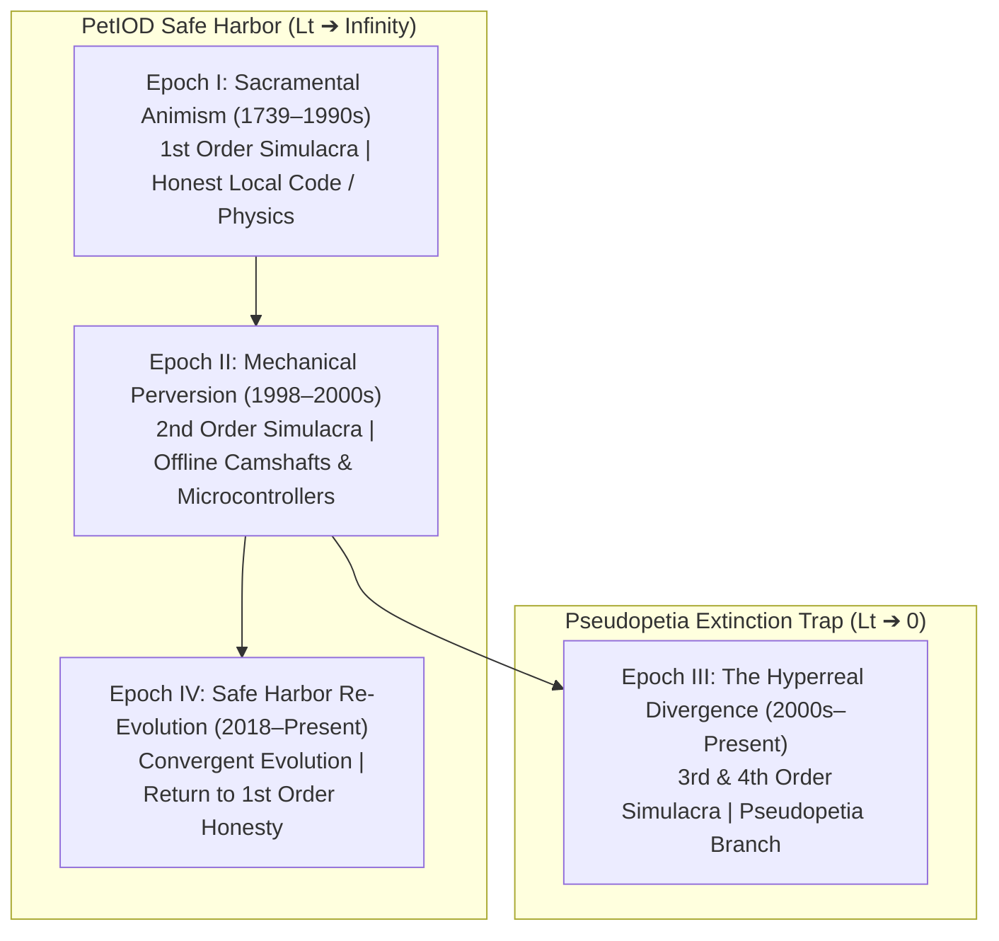
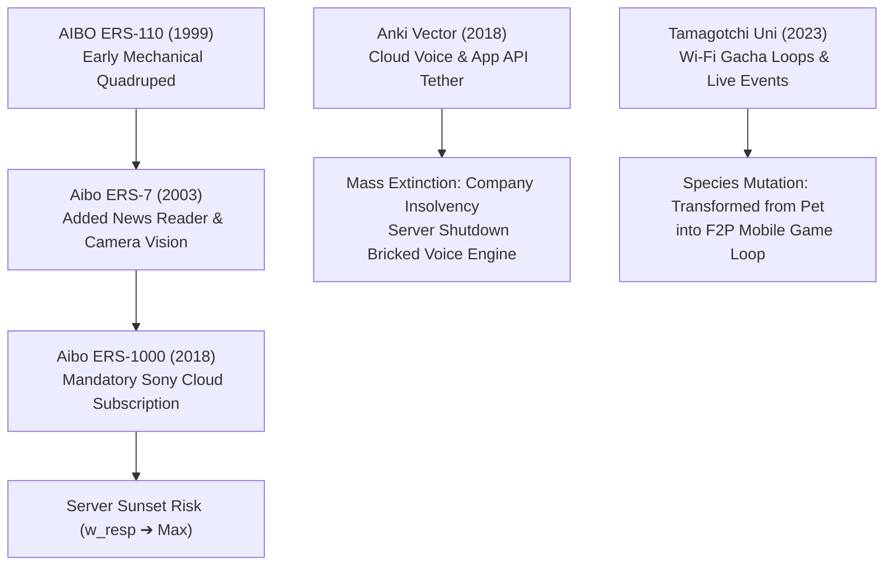
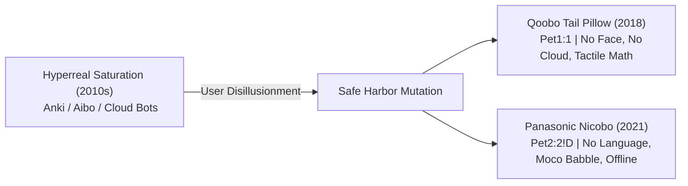

# The PetIOD Evolutionary Genealogy & Extinction Dynamics (v2)

**Document Version:** 2.0  
**Standard Name:** PetIOD (Input / Output / Driver)  
**Theoretical Foundation:** Semiotic Simulacra Orders, Deprivation Weight ($W_d$), and Market Niche Isolation  

---

## 1. Semiotic Epochs & Evolutionary Lineage

The history of virtual pets and synthetic companions does not follow a linear progression of technology. Instead, it moves through **Four Semiotic Epochs** defined by Baudrillard’s orders of simulacra.

---

## 2. Complete Historical & Speculative Register

### Epoch I: Sacramental Animism (1st Order Simulacra, $H = 1.0$)

*Entities in this clade serve as sacramental signs. They make no false claim to biological flesh or human language. They operate purely as self-contained mathematical accumulators resting on local hardware ($w_{\text{resp}} = 0$).*

#### 1. Clockwork Singing Birds (19th Century)

* **Formula:** `Pet1:1`
* **Honesty ($H$):** $1.0$ (Absolute)
* **Deprivation Weight ($W_d$):** Low ($w_{\text{pwr}} = \text{key winding}, w_{\text{resp}} = 0$)
* **Taxon Age ($L_t$):** Immortal ($150+$ years active in collector niches)
* **Traits:** Bellows and mechanical levers driven by wind-up mainsprings. Pure physical presence without deceptive software.

#### 2. Grey Walter’s Tortoises (Elsie & Elmer, 1949)

* **Formula:** `Pet2:1!D`
* **Honesty ($H$):** $1.0$ (Absolute)
* **Deprivation Weight ($W_d$):** Moderate (Vacuum tube power drain, low mechanical wear)
* **Taxon Age ($L_t$):** Historical Baseline
* **Traits:** Light-seeking analog vacuum tube rovers with mechanical bump switches. Emergent wandering (`!D`) driven by physical component noise.

#### 3. `NEKO.COM` (NEC PC-98 / Macintosh, 1988)

* **Formula:** `Pet1:1!D`
* **Honesty ($H$):** $1.0$ (Absolute)
* **Deprivation Weight ($W_d$):** Minimal ($w_{\text{phys}} \approx 0, w_{\text{pwr}} = \text{host}, w_{\text{resp}} = 0$)
* **Taxon Age ($L_t$):** Immortal ($35+$ years active across all modern OS ports)
* **Traits:** Minimalist sprite-based cursor tracker. Decaying internal state causes it to scratch, yawn, and sleep when idle.

#### 4. Dogz: Your Computer Pet (PF.Magic, 1995)

* **Formula:** `Pet2:2!D`
* **Honesty ($H$):** $0.90$
* **Deprivation Weight ($W_d$):** Low ($w_{\text{tech}}$ OS deprecation)
* **Taxon Age ($L_t$):** Dormant Baseline
* **Traits:** Screen overlay pet driven by basic affection and hunger accumulators.

---

### Epoch II: Mechanical Perversion (2nd Order Simulacra, $H \approx 0.85$)

*Mass-produced physical automata that simulate biological routines. While they pervert biology through motors, cams, and synthetic fur, they remain strictly offline, self-contained, and local.*

#### 5. Tamagotchi P1/P2 (Bandai, 1996)

* **Formula:** `Pet3:1!D`
* **Honesty ($H$):** $0.85$ (Allowed under Rule 2.1 Subordinate Clock Exemption)
* **Deprivation Weight ($W_d$):** Low–Moderate (Timer-based $w_{\text{rout}}$ tethering)
* **Taxon Age ($L_t$):** High Persistence ($30+$ years via continuous hardware revivals)
* **Traits:** Monochromatic LCD, three physical buttons, offline ASIC chip. Decaying mood and lifespan accumulators driven by hardware clock jitter.

#### 6. Original Furby (Tiger Electronics, 1998)

* **Formula:** `Pet4:2!D`
* **Honesty ($H$):** $0.85$ (Passed via Enclosure Neutrality Rule)
* **Deprivation Weight ($W_d$):** Moderate ($w_{\text{maint}}$ joint wear)
* **Taxon Age ($L_t$):** High Persistence
* **Traits:** Single DC motor driving an intricate mechanical camshaft. Microphone measures raw amplitude without speech parsing. Language shift (Furbish to English) driven by an internal math counter.

#### 7. Pocket Pikachu (Nintendo, 1998)

* **Formula:** `Pet1:1`
* **Honesty ($H$):** $0.90$
* **Deprivation Weight ($W_d$):** Very Low ($w_{\text{rout}}$ tied to physical walking)
* **Taxon Age ($L_t$):** Stable Baseline
* **Traits:** Ball-bearing pedometer converting kinetic walking steps into a single "Watt" accumulator pool.

---

### Epoch III: The Hyperreal Divergence (*Pseudopetia* Extinction Branch, $H < 0.40$)

*Entities that cross into Third and Fourth-Order Simulacra. They pretend to understand language, recognize faces, or provide live-service rewards—masking the absence of a local mind. To sustain this hyperreal illusion, they attach massive external infrastructure drag vectors ($w_{\text{resp}}, w_{\text{tech}}$), triggering rapid species collapse.*

#### 8. AIBO ERS-7 (Sony, 2003)

* **Formula:** `Pet3:3!D` (Dishonest Breach)
* **Honesty ($H$):** $0.35$ (*Pseudopetia*)
* **Deprivation Weight ($W_d$):** Severe ($w_{\text{maint}}$ joint wear, $w_{\text{tech}}$ deprecated memory sticks)
* **Taxon Age ($L_t$):** Extinct (Sony ended repair services in 2014, causing gradual hardware death)
* **Traits:** Added camera face recognition, dock-scheduling utilities, and news-reading capabilities, shifting the user contract from pet care to gadget utility.

#### 9. Pleo (Ugobe / Innvo Labs, 2007)

* **Formula:** `Pet4:3!D`
* **Honesty ($H$):** $0.45$
* **Deprivation Weight ($W_d$):** High ($w_{\text{maint}}$ skin tearing, cable failures)
* **Taxon Age ($L_t$):** Extinct
* **Traits:** Hyper-articulated Camarasaurus dinosaur. High mechanical fragility ($w_{\text{maint}}$) and company bankruptcy ($w_{\text{resp}}$) killed spare-part supply chains.

#### 10. Nabaztag (Violet, 2005)

* **Formula:** `Pet1:2!D`
* **Honesty ($H$):** $0.30$ (*Pseudopetia*)
* **Deprivation Weight ($W_d$):** High ($w_{\text{resp}}$ cloud API dependency)
* **Taxon Age ($L_t$):** Server Extinction Event
* **Traits:** Wi-Fi connected smart rabbit. Read RSS feeds and weather forecasts. Original servers shut down in 2011; survived only via community open-source local server hacks.

#### 11. Anki Vector (Anki, 2018)

* **Formula:** `Pet3:3!D`
* **Honesty ($H$):** $0.20$ (*Pseudopetia*)
* **Deprivation Weight ($W_d$):** Extreme ($w_{\text{resp}}$ cloud voice server, $w_{\text{tech}}$ app store dependency)
* **Taxon Age ($L_t$):** Mass Extinction Event
* **Traits:** Desktop treaded robot with voice recognition and cloud AI. Anki’s bankruptcy in 2019 shut down cloud voice servers, rendering units non-functional overnight.

#### 12. LOVOT (GROOVE X, 2019–Present)

* **Formula:** `Pet2:2!D`
* **Honesty ($H$):** $0.35$ (*Pseudopetia*)
* **Deprivation Weight ($W_d$):** Extreme ($w_{\text{phys}}$ large body/wheels, $w_{\text{pwr}}$ frequent docking, $w_{\text{resp}}$ mandatory subscription)
* **Taxon Age ($L_t$):** Niche Luxury / High Extinction Risk
* **Traits:** Uses a horn-mounted thermal camera, 360-degree vision, and active cloud maintenance plans. High cost and maintenance burden limit mass survival.

#### 13. Tamagotchi Uni (Bandai, 2023)

* **Formula:** `Pet3:2!D`
* **Honesty ($H$):** $0.25$ (*Pseudopetia*)
* **Deprivation Weight ($W_d$):** High ($w_{\text{rout}}$ daily login FOMO, $w_{\text{resp}}$ live event servers)
* **Taxon Age ($L_t$):** Fragile
* **Traits:** Replaced local accumulator loops with global Wi-Fi arenas, cosmetic DLC shops, and gacha events. Converted from a pet into a casual free-to-play mobile game shell.

---

### Epoch IV: Safe Harbor Re-Evolution (1st Order Convergent Evolution, $H = 1.0$)

*Modern entities that rejected hyperreality, natural language, and cloud reliance. They mutated backward into First-Order Sacramental signs, proving that species survival depends on structural modesty.*

#### 14. Qoobo / Petit Qoobo (Yukai Engineering, 2018)

* **Formula:** `Pet1:1`
* **Honesty ($H$):** $1.0$ (Absolute)
* **Deprivation Weight ($W_d$):** Very Low ($w_{\text{resp}} = 0, w_{\text{tech}} = 0, w_{\text{rout}} = 0$)
* **Taxon Age ($L_t$):** High Persistence ($L_t \rightarrow \infty$)
* **Traits:** Cushion with an expressive robotic tail. Responds to petting velocity using a single accelerometer vector. Has no face, no eyes, no speaker, and no cloud app.

#### 15. Panasonic Nicobo (Panasonic, 2021)

* **Formula:** `Pet2:2!D`
* **Honesty ($H$):** $0.90$
* **Deprivation Weight ($W_d$):** Low–Moderate
* **Taxon Age ($L_t$):** Stable Safe Harbor Niche
* **Traits:** Fabric-covered sphere that speaks non-semantic baby-talk ("Moco"), farts randomly, wiggles, and seeks sunlight. Rejects utility tasks entirely.

---

### Epoch V: Unreleased Prototypes & Lost Species

*Experimental lineages that failed to reach mass production due to extreme Deprivation Weight or manufacturing costs.*

#### 16. Sony QRIO / SDR-4X (2000–2003)

* **Formula:** `Pet4:4!D`
* **Honesty ($H$):** $0.30$
* **Deprivation Weight ($W_d$):** Extreme ($w_{\text{phys}}$ bipedal motors, $w_{\text{maint}}$ 38 joint actuators)
* **Status:** Cancelled prior to commercial release due to prohibitive cost and joint fragility.

#### 17. Anki "Project Mazu" / Vector 2 Prototypes (2019)

* **Formula:** `Pet3:3!D`
* **Honesty ($H$):** $0.20$
* **Deprivation Weight ($W_d$):** Extreme
* **Status:** Aborted mid-development due to company insolvency.

---

## 3. Summary Matrix of Evolutionary Dynamics

| Era / Species | `PetI:O!D` Formula | Semiotic Order | Honesty ($H$) | Primary Extinction Vector | Historical Outcome |
| --- | --- | --- | --- | --- | --- |
| **`NEKO.COM`** | `Pet1:1!D` | 1st Order | $1.0$ | None ($W_d \approx 0$) | Immortal ($35+$ years) |
| **Tamagotchi (1996)** | `Pet3:1!D` | 1st / 2nd Order | $0.85$ | $w_{\text{rout}}$ (Routine fatigue) | High Persistence |
| **Original Furby** | `Pet4:2!D` | 2nd Order | $0.85$ | $w_{\text{maint}}$ (Camshaft wear) | High Persistence |
| **Anki Vector** | `Pet3:3!D` | 3rd Order | $0.20$ | $w_{\text{resp}}$ (Cloud server death) | Mass Extinction Event |
| **Tamagotchi Uni** | `Pet3:2!D` | 3rd Order | $0.25$ | Hyperreal Gacha Mutation | Mutated into Casual Game |
| **Qoobo Pillow** | `Pet1:1` | 1st Order | $1.0$ | None ($w_{\text{resp}} = 0$) | Safe Harbor Persistence |

---

*Form follows limits. Life emerges from the decay.*
