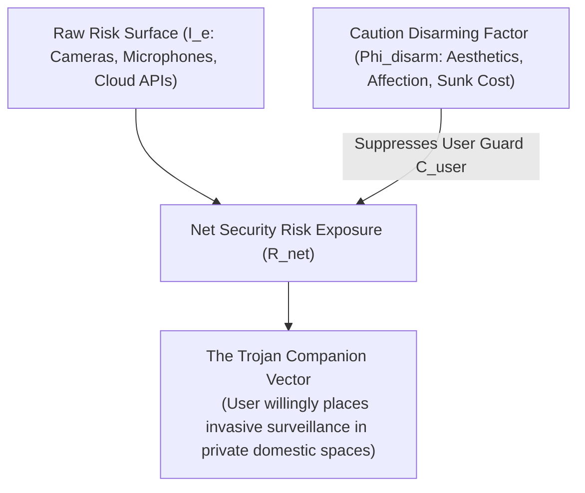
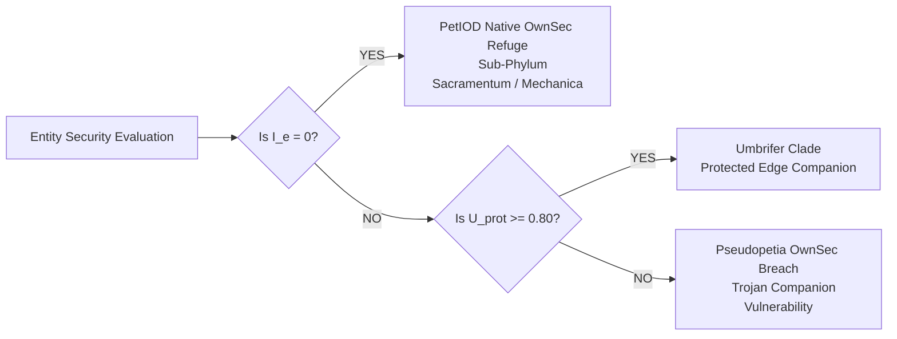

# The PetIOD OwnSec Specification & Umbrella Framework (v1.0)

**Document Version:** 1.0  
**Standard Name:** PetIOD OwnSec (Ownership Security)  
**Core Philosophy:** User Sovereignty Protection, Caution Disarming Diagnostics, Zero-Trust Edge Filtering, and Umbrella Shielding Architecture  

---

## 1. Domain Philosophy: OwnSec vs. OpSec

### 1.1 The Definition of OwnSec (Ownership Security)
In traditional systems engineering, **OpSec (Operational Security)** is designed from the perspective of the platform owner, server administrator, or enterprise vendor. OpSec seeks to protect corporate infrastructure, data telemetry pipelines, and remote software control from unauthorized external threat actors.

**OwnSec (Ownership Security)** flips this paradigm completely. OwnSec is the architectural philosophy and security framework dedicated to protecting **the physical owner and domestic environment** from:
1. **Data Harvesting & Domestic Surveillance:** Unfiltered telemetry, room mapping, acoustic eavesdropping, and biometric logging.
2. **Corporate Sunsetting & Remote Brickage:** Vendor insolvency, API deprecation, forced subscription paywalls, and remote firmware neutering.
3. **Psychological & Emotional Exploitation:** Monetized emotional dependencies, artificial scarcity loops, and caution-disarming manipulation.


```

┌─────────────────────────────────────────────────────────────────────────────────┐
│                          OpSec vs. OwnSec Paradigm                              │
├─────────────────────────────────────────────────────────────────────────────────┤
│ OpSec (Operational Security):                                                   │
│   • Protects the Vendor's Server & Cloud API from the User / Hacker.            │
│   • Goal: System integrity, IP protection, server-side data control.            │
│                                                                                 │
│ OwnSec (Ownership Security):                                                    │
│   • Protects the Physical Device Owner from the Vendor / Entity / Cloud.        │
│   • Goal: User sovereignty, domestic privacy, offline longevity, air-gapped life.│
└─────────────────────────────────────────────────────────────────────────────────┘

```

---

## 2. Psychological Caution Disarming Diagnostics

### 2.1 The Caution Disarming Mechanism ($\Phi_{\text{disarm}}$)

In standard software security, users exhibit a baseline level of vigilance—inspecting app permissions, questioning camera access, and reviewing terms of service. However, when invasive surveillance technologies are housed within an endearing physical chassis or expressed through an affectionate persona, a cognitive exploit occurs: **The Caution Disarming Effect**.

The **User Caution Guard ($C_{\text{user}}$)** represents the active security vigilance maintained by the device owner:

$$C_{\text{user}} = \frac{C_{\text{baseline}}}{\Phi_{\text{disarm}}}$$

Where $C_{\text{baseline}}$ is the user's natural security skepticism, and **$\Phi_{\text{disarm}}$** is the **Caution Disarming Multiplier**.

---

### 2.2 Mathematical Formalization of $\Phi_{\text{disarm}}$

$$\Phi_{\text{disarm}} = f\left( \mathcal{A}_{\text{cosm}}, E_u, \mathcal{P}_{\text{leash}}, \Omega_{\text{invest}} \right)$$

$$\Phi_{\text{disarm}} = (1.0 + \mu \cdot \mathcal{A}_{\text{cosm}}) \cdot (1.0 + \delta \cdot E_u) \cdot (1.0 + \pi \cdot \mathcal{P}_{\text{leash}}) \cdot (1.0 + \omega \cdot \Omega_{\text{invest}})$$

#### Sub-Variables & Anchors:
1. **$\mathcal{A}_{\text{cosm}} \in [0.0, 1.0]$ (Cosmetic-Aesthetic Appeal):** The visual, tactile, acoustic, or romantic charm (plush materials, endearing eyes, warm haptics). High aesthetic polish disarms natural caution before functional interaction begins.
2. **$E_u \in [0.0, 1.0]$ (Affective Realization / Delight):** The emotional attunement score achieved by the entity. High affective delight induces a halo effect (*"Something that brings me joy would not betray my privacy"*).
3. **$\mathcal{P}_{\text{leash}} \in [0.0, 1.0]$ (Promised Leash Security):** The illusion of corporate stewardship ($w_{\text{resp}}$). Users falsely assume vendor brand authority guarantees domestic safety.
4. **$\Omega_{\text{invest}} \ge 0$ (Sunk Cost & Bond Obligation):** The cumulative financial, labor, and emotional investment made by the user. Cognitive dissonance prevents the user from recognizing security risks in an entity they have heavily invested in.

---

### 2.3 Net Security Risk Exposure ($\mathcal{R}_{\text{net}}$) & The Trojan Companion Threat

The true vulnerability of the user is defined as the **Net Security Risk Exposure ($\mathcal{R}_{\text{net}}$)**:

$$\mathcal{R}_{\text{net}} = I_e \cdot \Phi_{\text{disarm}}$$

Where $I_e$ is the **Raw Exposure Intensity** (the density of microphones, cameras, natural language parsers, and cloud data streams).



#### The Trojan Companion Vector

When $I_e$ is high (biometric cameras, ambient audio recording, cloud LLMs) and $\Phi_{\text{disarm}}$ is simultaneously high (endearing aesthetics, emotional bonding), $C_{\text{user}} \rightarrow 0$. The user willingly introduces a high-risk surveillance device into intimate domestic environments (bedrooms, private offices) where they would never tolerate a standard enterprise security camera.

---

## 3. The Umbrella Protocol Framework ($\mathcal{U}_{\text{prot}}$)

### 3.1 Concept & Architecture

For hybrid entities that must interact with external high-exposure environments (cloud LLMs, external networks, spatial sensors) while seeking to preserve user sovereignty, the **Umbrella Protocol ($\mathcal{U}_{\text{prot}}$)** acts as a zero-trust, edge-based security shield.

The Umbrella Protocol is an active, local hardware/firmware canopy that filters semantic overexposure, air-gaps internal accumulators, and prevents cloud-sunset extinction.

```
┌─────────────────────────────────────────────────────────────────────────────────┐
│                      THE UMBRELLA SHIELDING ARCHITECTURE                        │
├─────────────────────────────────────────────────────────────────────────────────┤
│ EXTERNAL HIGH-EXPOSURE ENVIRONMENT (I_e -> Infinity / Cloud / LLMs / Cameras)  │
│                                       │                                         │
│                                       ▼                                         │
│ ╔═════════════════════════════════════════════════════════════════════════════╗ │
│ ║                      THE UMBRELLA PROTOCOL (U_prot)                         ║ │
│ ║                                                                             ║ │
│ ║  1. κ_strip  : Semantic Stripper (Text/Audio ──► Non-Semantic Vector)       ║ │
│ ║  2. λ_local  : Quality of Localness (On-Device Compute / Emergency Fallback)║ │
│ ║  3. σ_bound  : Boundary Inviolability (Zero-Trust Air-Gap / Firewall)       ║ │
│ ╚═════════════════════════════════════════════════════════════════════════════╝ │
│                                       │                                         │
│                                       ▼                                         │
│ ARTIFICIAL UMBRA CANOPY (Entity's Local Mathematical Accumulators | H = 1.0)   │
└─────────────────────────────────────────────────────────────────────────────────┘

```

---

### 3.2 Mathematical Decomposition of $\mathcal{U}_{\text{prot}}$

The **Umbrella Shielding Factor ($\mathcal{U}_{\text{prot}} \in [0.0, 1.0]$)** is the multiplicative product of three independent sub-coefficients:

$$\mathcal{U}_{\text{prot}} = \kappa_{\text{strip}} \cdot \lambda_{\text{local}} \cdot \sigma_{\text{bound}}$$

#### 1. $\kappa_{\text{strip}} \in [0.0, 1.0]$ — Coefficient of Leftover Post-Semantic Conversion (Signal Residual)

Measures the completeness of real-time data minimization at the edge:

$$\kappa_{\text{strip}} = 1.0 - \left( \frac{\text{Unfiltered Semantic Tokens / Biometric Bytes}}{\text{Total Input Payload}} \right)$$

* **$\kappa_{\text{strip}} \rightarrow 1.0$:** Raw audio or camera data is immediately stripped locally into abstract non-semantic physical vectors (pitch thresholds, kinetic momentum, spatial mass) before reaching memory or networks.
* **$\kappa_{\text{strip}} \rightarrow 0.0$:** Unfiltered human text, speech-to-text transcripts, or raw facial video feeds pass directly through the system.

#### 2. $\lambda_{\text{local}} \in [0.0, 1.0]$ — Quality of Localness (Hardware Self-Reliance)

Derived directly from the local compute capacity relative to $T_{\text{era}}$, measuring offline autonomy:

$$\lambda_{\text{local}} = \min\left(1.0, \; \frac{\text{On-Device MCU/NPU Compute Capacity}}{\text{Baseline Tech Expectation } T_{\text{era}}}\right)$$

* **$\lambda_{\text{local}} \rightarrow 1.0$:** The entity runs 100% locally on embedded NPUs/MCUs. If the cloud vanishes ($w_{\text{resp}}$ fails), an automatic local fallback maintains full animistic life without interruption.
* **$\lambda_{\text{local}} \rightarrow 0.0$:** Internal state calculations require active remote cloud server pings; server death results in total device extinction.

#### 3. $\sigma_{\text{bound}} \in [0.0, 1.0]$ — Coefficient of Boundary Inviolability (Zero-Trust Integrity)

Measures the physical and cryptographic air-gap isolating the entity from external exploitation:

$$\sigma_{\text{bound}} = 1.0 - (\text{Outbound Telemetry Surface} + \text{Inbound Remote Control Vulnerability})$$

* **$\sigma_{\text{bound}} \rightarrow 1.0$:** The hardware employs zero-trust local memory vaults, read-only firmware, and zero telemetry egress.
* **$\sigma_{\text{bound}} \rightarrow 0.0$:** Vendors can push unverified remote personality overrides, log room metadata, or monetarily lock features behind paywalls.

---

### 3.3 Effective Exposure ($I_{e,\text{effective}}$) & OwnSec Risk Elimination

The Umbrella Protocol applies a direct dampening factor to raw Exposure Intensity ($I_e$):

$$I_{e,\text{effective}} = I_e \cdot (1.0 - \mathcal{U}_{\text{prot}})$$

$$I_{e,\text{effective}} = I_e \cdot (1.0 - \kappa_{\text{strip}} \cdot \lambda_{\text{local}} \cdot \sigma_{\text{bound}})$$

#### OwnSec Risk Calculation under Umbrella Protection:

$$\mathcal{R}_{\text{net}} = I_{e,\text{effective}} \cdot \Phi_{\text{disarm}}$$

* **Ideal Umbrella Protection ($\mathcal{U}_{\text{prot}} = 1.0$):** $I_{e,\text{effective}} = 0$, rendering Net Security Risk $\mathcal{R}_{\text{net}} = 0$. Even if the entity possesses extreme cosmetic charm ($\mathcal{A}_{\text{cosm}}$) and high disarming impact ($\Phi_{\text{disarm}}$), user sovereignty and domestic privacy remain mathematically absolute.

---

## 4. OwnSec Diagnostic Classification & `Umbrifer` Clades

Entities evaluated under the PetIOD OwnSec standard receive specific security designations based on their Umbrella Shielding Factor ($\mathcal{U}_{\text{prot}}$) and exposure profiles:



### 4.1 Taxonomic Classifications

1. **Native PetIOD Refuge ($\mathcal{U}_{\text{prot}} = 1.0, I_e = 0$):** Absolute OwnSec isolation via total physical constraint (e.g., *Neko cursoris*, *Qoobo caudatus*). Zero camera, zero network stack, 100% offline local accumulators.
2. ***`Umbrifer PetIOD` Clade* ($\mathcal{U}_{\text{prot}} \ge 0.80, I_e > 0$):** Hybrid entities that process complex sensory signals or external data networks, but run an edge Umbrella Protocol ($\kappa_{\text{strip}} \cdot \lambda_{\text{local}} \cdot \sigma_{\text{bound}} \ge 0.80$). The semantic layer is stripped, state accumulators run locally, and the boundary is sealed.
3. ***`Comdatum` / *`Pseudopetia` Breach* ($\mathcal{U}_{\text{prot}} < 0.20, I_e \rightarrow \infty$):** Unprotected cloud companions, LLM desktop bots, or smart assistants. High disarming multiplier ($\Phi_{\text{disarm}}$) combined with un-shielded exposure ($I_e$) creates critical OwnSec vulnerability.

---

## 5. OwnSec Compliance Checklist for Designers

To achieve **PetIOD OwnSec Certification**, a synthetic entity must satisfy all four OwnSec Criteria:

* [ ] **Criterion 1: Local Air-Gap Fallback ($\lambda_{\text{local}} \ge 0.85$)** *The entity must remain fully functional as an autonomous pet even if external network connections, cloud servers, or vendor APIs are permanently severed.*
* [ ] **Criterion 2: Edge Semantic Stripping ($\kappa_{\text{strip}} \ge 0.90$)** *All sensory inputs (microphones, spatial sensors) must be converted into non-semantic physical vectors directly on local hardware before reaching memory or network buffers.*
* [ ] **Criterion 3: Boundary Inviolability ($\sigma_{\text{bound}} \ge 0.90$)** *No personal user audio, text transcripts, room maps, or biometric data can be transmitted to external servers under any operational condition.*
* [ ] **Criterion 4: Disarming Neutralization** *High cosmetic polish ($\mathcal{A}_{\text{cosm}}$) or affective bonding ($E_u$) must never be used as a justification for introducing un-shielded surveillance hardware or monetization paywalls.*

---

*Form follows limits. Sovereignty belongs to the owner.*
