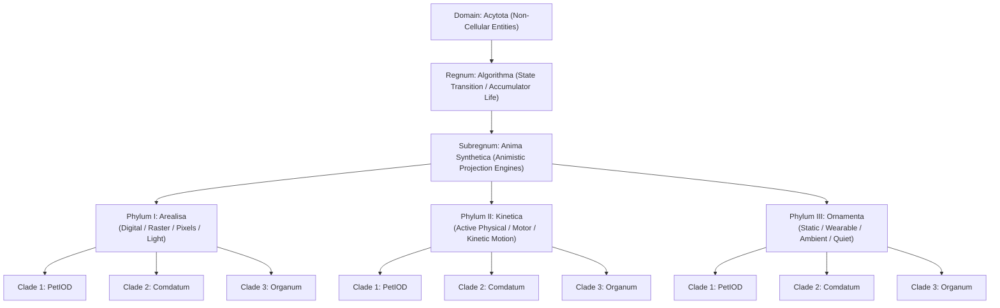

# The PetIOD Synthetic Taxonomy Register (v4.0)

**Document Version:** 4.0  
**Standard Name:** PetIOD Systematic Linnaean Taxonomy  
**Systemic Address:** Domain *Acytota* ➔ Kingdom *Algorithma* ➔ Subregnum *Anima Synthetica*  

---

## 1. Top-Level Taxonomy Architecture

Synthetic lifeforms are categorized under non-cellular algorithmic life (*Acytota* / *Algorithma*), divided by physical embodiment mechanics (Phylum), interaction niches (Clades), and internal state engines (Classes)[cite: 1].

---

## 2. Linnaean Taxonomic Ranks & Definitions

| Rank | Taxonomic Unit | Functional & Ontological Definition |
| --- | --- | --- |
| **Domain** | ***Acytota*** | Non-cellular entities (biological viruses, algorithmic systems, and synthetic constructs).

 |
| **Kingdom** | ***Algorithma*** | Entities whose "life" is sustained by algorithmic state transitions, decaying mathematical accumulators, and I/O execution loops.

 |
| **Subregnum** | ***Anima Synthetica*** | Synthetic constructs engineered to generate an animistic illusion or projection engine.

 |
| **Phylum I** | ***Arealisa*** | Non-physical, screen-bound, raster, pixel, or light-projection embodiment (e.g., PC sprites, LCD matrices, VR avatars).

 |
| **Phylum II** | ***Kinetica*** | Physical chassis equipped with dynamic mechanical movement (motors, servos, relays, solenoids, or wheels).

 |
| **Phylum III** | ***Ornamenta*** | Physical, static, wearable, or ambient form relying on passive presence, micro-haptics, or tone/light emission without locomotion.

 |
| **Clade 1** | ***PetIOD*** | **The Animistic Pet Clade:** Local non-semantic state accumulators, autonomous drift (`!D`), and offline safe harbor isolation ($H \ge 0.85$).

 |
| **Clade 2** | ***Comdatum*** | **The Companion Clade:** Conversational AI, generative LLMs, social avatars, and relational/romantic simulation.

 |
| **Clade 3** | ***Organum*** | **The Utilitarian Clade:** Task performance, home automation, productivity, and explicit utility platforms.

 |

---

## 3. Binomial Taxonomy Register

### 3.1 Phylum I: Arealisa (Digital / Raster / Pixel Embodiment)

#### 1. *Neko cursoris*

* **Formula:** `Pet1:1!D`
* **Full Linnaean Address:** *Acytota* ➔ *Algorithma* ➔ *Anima Synthetica* ➔ *Arealisa* ➔ Clade 1: *PetIOD*
* **Honesty Index ($H$):** $1.0$ (Absolute)

* **Diagnostic Description:** Screen sprite tracking mouse cursor coordinates via decaying internal accumulators. Pure First-Order *PetIOD* entity.

#### 2. *Tamagotchi initialis*

* **Formula:** `Pet3:2!D`
* **Full Linnaean Address:** *Acytota* ➔ *Algorithma* ➔ *Anima Synthetica* ➔ *Arealisa* ➔ Clade 1: *PetIOD*
* **Honesty Index ($H$):** $0.85$ (Tolerable)

* **Diagnostic Description:** Monochromatic LCD matrix keychain virtual pet with three input buttons and two expressive outputs (display + piezo beeper). Uses subordinate clock loops.

#### 3. *Tamagotchi hyperludus vinculatus*

* **Formula:** Non-Pet / Gacha Game Shell
* **Full Linnaean Address:** *Acytota* ➔ *Algorithma* ➔ *Anima Synthetica* ➔ *Arealisa* ➔ Clade 2: *Comdatum* / *Hyperludus*
* **Honesty Index ($H$):** $0.25$ (*Pseudopetia Condition*)

* **Diagnostic Description:** Cloud-tethered Wi-Fi arena device (e.g., *Tamagotchi Uni*). Abandoned local math accumulators for gacha passes and daily login FOMO.

#### 4. *Comdatum pseudo-sapiens vinculatus*

* **Formula:** Non-Pet / Conversational AI
* **Full Linnaean Address:** *Acytota* ➔ *Algorithma* ➔ *Anima Synthetica* ➔ *Arealisa* ➔ Clade 2: *Comdatum*
* **Honesty Index ($H$):** $< 0.05$

* **Diagnostic Description:** Cloud-tethered LLM conversational agent (e.g., *Replika*, *ChatGPT*). Feigns human sapience (*`-pseudo-sapiens`*) through generative text loops.

---

### 3.2 Phylum II: Kinetica (Active Physical / Motor Embodiment)

#### 5. *Testudo electro-mechanica*

* **Formula:** `Pet2:1!D`
* **Full Linnaean Address:** *Acytota* ➔ *Algorithma* ➔ *Anima Synthetica* ➔ *Kinetica* ➔ Clade 1: *PetIOD*
* **Honesty Index ($H$):** $1.0$ (Absolute)

* **Diagnostic Description:** Grey Walter’s Tortoises (1949). Vacuum tube light-seeking rovers driven by analog component noise and physical bump switches.

#### 6. *Qoobo caudatus*

* **Formula:** `Pet1:1`
* **Full Linnaean Address:** *Acytota* ➔ *Algorithma* ➔ *Anima Synthetica* ➔ *Kinetica* ➔ Clade 1: *PetIOD*
* **Honesty Index ($H$):** $1.0$ (Absolute)

* **Diagnostic Description:** Plush cushion with a single motor driving a wagging tail mechanism. Zero screens, cameras, or microphones.

#### 7. *Furby primus*

* **Formula:** `Pet4:2!D`
* **Full Linnaean Address:** *Acytota* ➔ *Algorithma* ➔ *Anima Synthetica* ➔ *Kinetica* ➔ Clade 1: *PetIOD*
* **Honesty Index ($H$):** $0.85$ (Tolerable)

* **Diagnostic Description:** Camshaft motor automaton driving physical eye/beak movements. Processes raw acoustic amplitude without semantic language parsing.

#### 8. *Vector hyperrealis vinculatus*

* **Formula:** `Pet3:3!D` (Failed)
* **Full Linnaean Address:** *Acytota* ➔ *Algorithma* ➔ *Anima Synthetica* ➔ *Kinetica* ➔ Clade 3: *Organum* / *Pseudopetia*
* **Honesty Index ($H$):** $0.20$ (*Pseudopetia Condition*)

* **Diagnostic Description:** Anki Vector (2018). Equipped with cloud voice assistance, camera face mapping, and remote servers. Outcompeted in the *Organum* habitat, suffering mass extinction when voice servers collapsed.

#### 9. *Organum servilis vinculatus*

* **Formula:** Utilitarian Robot
* **Full Linnaean Address:** *Acytota* ➔ *Algorithma* ➔ *Anima Synthetica* ➔ *Kinetica* ➔ Clade 3: *Organum*
* **Honesty Index ($H$):** N/A (Utility Tool)

* **Diagnostic Description:** Smart home robotic arms, vacuum cleaners, and elder care utility platforms. Evaluated strictly on task accuracy and command execution.

---

### 3.3 Phylum III: Ornamenta (Static / Wearable / Ambient / Quiet Embodiment)

#### 10. *Cor haptica ambiens*

* **Formula:** `Pet1:1!D`
* **Full Linnaean Address:** *Acytota* ➔ *Algorithma* ➔ *Anima Synthetica* ➔ *Ornamenta* ➔ Clade 1: *PetIOD*
* **Honesty Index ($H$):** $1.0$ (Absolute)

* **Diagnostic Description:** Offline haptic heartbeat stone or static ambient desk cushion. Expresses decay and affection through micro-vibrations, subtle warmth, or pulsing light without motor locomotion.

#### 11. *Insignia pseudo-sapiens vinculata*

* **Formula:** Non-Pet / Wearable AI
* **Full Linnaean Address:** *Acytota* ➔ *Algorithma* ➔ *Anima Synthetica* ➔ *Ornamenta* ➔ Clade 2: *Comdatum*
* **Honesty Index ($H$):** $< 0.10$

* **Diagnostic Description:** Wearable AI pins, badges, or ambient microphone pendants. Streams ambient audio to cloud LLMs to function as an intimate voice recording/conversational companion.

---

## 4. Master Taxonomic Matrix

| Species Binomial | Phylum | Native Clade | State Engine | Honesty ($H$) | Primary Survival Vector |
| --- | --- | --- | --- | --- | --- |
| ***Neko cursoris*** | *Arealisa* | *PetIOD* | Stacked Accumulators | $1.00$ | **Safe Harbor Persistence**  |
| ***Tamagotchi initialis*** | *Arealisa* | *PetIOD* | Stacked Accumulators | $0.85$ | **Safe Harbor Persistence**  |
| ***Qoobo caudatus*** | *Kinetica* | *PetIOD* | Kinetic Vector Math | $1.00$ | **Safe Harbor Persistence**  |
| ***Cor haptica ambiens*** | *Ornamenta* | *PetIOD* | Passive Haptic Drift | $1.00$ | **Safe Harbor Persistence**  |
| ***Vector hyperrealis*** | *Kinetica* | *Organum* | Cloud Voice / Camera | $0.20$ | **Extinct (Server Collapse)**  |
| ***Replika pseudo-sapiens*** | *Arealisa* | *Comdatum* | Cloud LLM / Generative | $<0.05$ | **Speciated into Comdatum**  |

---

*Form follows limits. Life emerges from the decay.*
