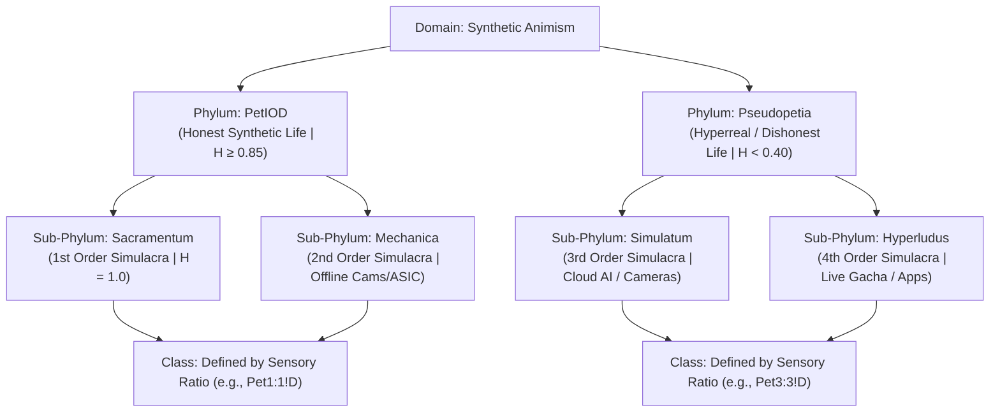

# The PetIOD Formal Taxonomy & Taxonomic Register (v2)

**Document Version:** 2.0  
**Standard Name:** PetIOD (Input / Output / Driver)  
**Classification System:** Modified Binomial Linnaean Nomenclature for Synthetic Life  

---

## 1. Systemic Taxonomic Hierarchy

To categorize synthetic companions across historical epochs and modern design frameworks, PetIOD utilizes a four-tier biological taxonomy based on semiotic orders, structural input-output ratios, and mechanical/software execution.



### High-Level Taxonomy Breakdown

1. **Domain:** *Synthetic Animism*
2. **Phylum PetIOD (Honest Entities):**
* **Sub-Phylum *Sacramentum* (1st Order Simulacra):** Entities possessing absolute honesty ($H = 1.0$). They have zero screen overlays, no clock menus, zero cloud ties, and rely strictly on local physical/vector expression.
* **Sub-Phylum *Mechanica* (2nd Order Simulacra):** Offline physical/embedded entities using mechanical camshafts, relays, or subordinate circadian clocks ($H \ge 0.85$).


3. **Phylum Pseudopetia (Dishonest / Hyperreal Entities):**
* **Sub-Phylum *Simulatum* (3rd Order Simulacra):** Entities that fake semantic intent, voice understanding, or face recognition using cameras, cloud LLMs, or active server connections.
* **Sub-Phylum *Hyperludus* (4th Order Simulacra):** Entities that abandon local autonomous accumulators for live-service gacha loops, daily login timers, downloadable cosmetic passes, and subscription storefronts.


4. **Class:** Defined strictly by the structural sensory formula (e.g., `Class Pet3:1!D`, `Class Pet1:1!D`, `Class Pet2:2!D`).
5. **Genus:** The recognized brand lineage, design archetype, or physical form factor (e.g., *Tamagotchi*, *Neko*, *Anas*, *Qoobo*).
6. **Specific Epithet (Tail Name):** Descriptive Latin adjectives indicating semiotic clade, physical movement mode, or structural vulnerability.

---

## 2. Structural & Anatomical Rules

### The Enclosure Neutrality Rule

Physical housing materials (synthetic fur, milled walnut, brass, silicone, cast plastic) do **not** constitute Mimetical Dishonesty as long as the underlying sensors and outputs remain strictly bound to raw physics and non-semantic accumulators. Dishonesty occurs strictly when the software or presentation layer simulates biological flesh processes, semantic intent parsing, or utilitarian productivity tools.

### Binomial Nomenclature Construction

Every entity within the PetIOD framework receives a standardized Linnaean binomial species name:

$$\text{Genus} \quad \text{epithet}$$

#### Standard Epithet (Tail Name) Lexicon

* **`-initialis` / `-primus`:** Founding or first-generation baseline species of a lineage.
* **`-sacramentalis`:** Pure First-Order entity ($H = 1.0$) with zero screen overlays, no clock menus, and zero cloud ties.
* **`-cursoris`:** Software entity bound directly to screen cursor movement or coordinate tracking.
* **`-caudatus`:** Entity expressing internal state via a physical responsive tail mechanism.
* **`-electro-mechanica`:** Driven by mechanical relays, motors, gears, or physical camshafts.
* **`-vulnerabilis`:** Structurally fragile or high-maintenance entity prone to mechanical joint wear or user-fatigue decay.
* **`-hyperrealis`:** Third/Fourth-Order entity trapped in cloud server dependencies ($w_{\text{resp}} > 0$).
* **`-pseudopetia`:** Entity that has abandoned local autonomous animism for tool utility or monetization loops.
* **`-ambiens`:** Low-maintenance ambient companion operating continuously in the background.

---

## 3. The Taxonomic Register (Real-World & Theoretical Specimen)

### Phylum PetIOD (Honest Synthetic Life)

#### Sub-Phylum *Sacramentum* (1st Order Simulacra, $H = 1.0$)

* **`NEKO.COM` (1988)**
* **Taxonomic Name:** *Neko cursoris*
* **Class:** `Pet1:1!D`
* **Honesty ($H$):** $1.0$ (Absolute)
* **Deprivation Weight ($W_d$):** Minimal
* **Traits:** Screen-bound cursor tracker. Minimalist sprite driven by passive accumulator decay and idle drifting (`!D`).


* **Grey Walter’s Tortoises (1949)**
* **Taxonomic Name:** *Testudo electro-mechanica*
* **Class:** `Pet2:1!D`
* **Honesty ($H$):** $1.0$ (Absolute)
* **Deprivation Weight ($W_d$):** Moderate
* **Traits:** Light-seeking analog rover using vacuum tubes, light sensors, and bump switches.


* **Qoobo Tail Pillow (2018)**
* **Taxonomic Name:** *Qoobo caudatus*
* **Class:** `Pet1:1`
* **Honesty ($H$):** $1.0$ (Absolute)
* **Deprivation Weight ($W_d$):** Very Low
* **Traits:** Cushion equipped with a single motor-driven tail. Responds proportionally to petting velocity; contains no face, screen, or speaker.


#### Sub-Phylum *Mechanica* (2nd Order Simulacra, $H \ge 0.85$)

* **Original Tamagotchi (1996)**
* **Taxonomic Name:** *Tamagotchi initialis*
* **Class:** `Pet3:1!D`
* **Honesty ($H$):** $0.85$ (Allowed under Rule 2.1 Subordinate Clock Clause)
* **Deprivation Weight ($W_d$):** Low–Moderate
* **Traits:** Keychain LCD with three buttons. State governed by decaying hunger/discipline accumulators and hardware clock jitter.


* **Original Furby (1998)**
* **Taxonomic Name:** *Furby primus*
* **Class:** `Pet4:2!D`
* **Honesty ($H$):** $0.85$ (Passed via Enclosure Neutrality Rule)
* **Deprivation Weight ($W_d$):** Moderate
* **Traits:** Mechanical camshaft automaton. Processes raw sound amplitude without speech recognition.


* **Panasonic Nicobo (2021)**
* **Taxonomic Name:** *Nicobo vulnerabilis*
* **Class:** `Pet2:2!D`
* **Honesty ($H$):** $0.90$
* **Deprivation Weight ($W_d$):** Low–Moderate
* **Traits:** Fabric-covered sphere that speaks non-semantic babble ("Moco"), turns toward noise, and wiggles randomly. Zero cloud reliance.


---

### Phylum Pseudopetia (Dishonest / Hyperreal Entities)

#### Sub-Phylum *Simulatum* (3rd Order Simulacra, Cloud / Camera / Semantic Breach)

* **Sony Aibo ERS-7 (2003)**
* **Taxonomic Name:** *Aibo pseudopetia*
* **Class:** `Pet3:3!D`
* **Honesty ($H$):** $0.35$
* **Deprivation Weight ($W_d$):** Severe
* **Traits:** Breached limits via camera vision, news-reading capabilities, and dock-scheduling utilities.


* **Anki Vector (2018)**
* **Taxonomic Name:** *Vector hyperrealis*
* **Class:** `Pet3:3!D`
* **Honesty ($H$):** $0.20$
* **Deprivation Weight ($W_d$):** Extreme
* **Traits:** Cloud-connected desktop robot. Server shutdown rendered voice engine and interactive personality extinct.


* **LOVOT (2019)**
* **Taxonomic Name:** *Lovot cloudis*
* **Class:** `Pet2:2!D`
* **Honesty ($H$):** $0.35$
* **Deprivation Weight ($W_d$):** Extreme
* **Traits:** Mobile robotic companion dependent on thermal cameras, 360-degree vision, and mandatory cloud service subscriptions.


#### Sub-Phylum *Hyperludus* (4th Order Simulacra, Live-Service / Gacha Loops)

* **Tamagotchi Uni (2023)**
* **Taxonomic Name:** *Tamagotchi hyperludus*
* **Class:** `Pet3:2!D`
* **Honesty ($H$):** $0.25$
* **Deprivation Weight ($W_d$):** High
* **Traits:** Wi-Fi keychain pet featuring live-event arenas, downloadable DLC passes, and daily login rewards. Mutated from a pet into a casual mobile game.


---

## 4. Taxonomic Diagnostic Checklist for Designers

A maker can evaluate a concept against this diagnostic checklist to determine its taxonomic placement before writing code or manufacturing hardware:

```
[INPUT EVALUATION]
├─ Does it use cameras, voice-to-text, or face recognition? ──► YES: Classify as Phylum Pseudopetia
└─ Does it use raw sensors (touch, PIR, light, ToF)? ───────────► NO: Continue to Output Evaluation

[OUTPUT EVALUATION]
├─ Does it show clock menus as the primary default screen? ─────► YES: Violates Rule 2.1 (Pseudopetia)
├─ Does it send smartphone notifications or calendar alarms? ─► YES: Violates Rule 2 (Pseudopetia)
└─ Does it use raw physical motor/vector expression? ───────────► NO: Continue to Architecture

[ARCHITECTURE EVALUATION]
├─ Does it rely on cloud LLMs or active server pings? ─────────► YES: Classify as Sub-Phylum Simulatum (w_resp surge)
├─ Does it use daily login rewards or gacha item stores? ──────► YES: Classify as Sub-Phylum Hyperludus
└─ Does it use decaying local math accumulators + drift (!D)? ──► YES: CLASSIFIED AS PHYLUM PetIOD (Safe Harbor)

```

---

*Form follows limits. Life emerges from the decay.*
