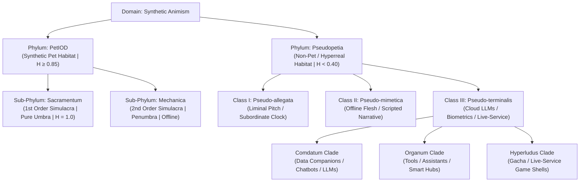

# The PetIOD Standard: Formal Taxonomy & Taxonomic Register (v3.0)

**Document Version:** 3.0  
**Standard Name:** PetIOD (Input / Output / Driver)  
**Classification Philosophy:** Binomial Nomenclature for Synthetic Life, Ecological Niche Boundary Isolation, and Optical Projection Metrics  

---

## 1. Systemic Taxonomic Hierarchy & Ecological Habitats

To categorize synthetic companions across historical epochs and modern design frameworks, PetIOD utilizes a four-tier biological taxonomy. This system isolates true synthetic pet niches from neighboring hyperreal habitats, avoiding moralizing assumptions while establishing rigid mathematical and ecological boundaries.



### High-Level Taxonomy Breakdown

1. **Domain:** *Synthetic Animism*
2. **Phylum PetIOD (Synthetic Pet Habitat):**
* **Sub-Phylum *Sacramentum* (1st Order Simulacra | Pure Passive Umbra):** Entities possessing absolute honesty ($H = 1.0$). They feature zero screen overlays, no clock menus, zero cloud ties ($w_{\text{resp}} = 0$), and rely strictly on local physical/vector expression.
* **Sub-Phylum *Mechanica* (2nd Order Simulacra | Active Umbra & Penumbra):** Offline physical/embedded entities using mechanical camshafts, relays, or subordinate circadian clocks ($H \ge 0.85$).


3. **Phylum Pseudopetia (Non-Pet / Hyperreal Habitat):**
* **Class I: *Pseudo-allegata* (Liminal Transgression):** Entities utilizing non-semantic pitch tracking or subordinate clock overlays while remaining offline ($w_{\text{resp}} = 0$).
* **Class II: *Pseudo-mimetica* (Mimetical / Narrative Deceit):** Offline entities simulating biological flesh, human faces, or pre-scripted linguistic narrative trees.
* **Class III: *Pseudo-terminalis* (Terminal Infrastructure Dependency):** Entities bound to cloud servers, generative LLMs, biometric cameras, or subscription storefronts ($w_{\text{resp}} > 0$).


4. **Genus:** The recognized brand lineage, design archetype, or functional clade:
* **`PetIOD` Clade:** Restricted strictly to honest or subordinate synthetic pets (*Tamagotchi*, *Neko*, *Anas*, *Qoobo*).
* **`Comdatum` Clade:** Generative AI agents, LLMs, and social chatbots (derived from *comes/comitis* + *datum*; explicitly rejecting *companis* as data entities share no bread).
* **`Organum` Clade:** Task-oriented tools, smart speakers, and productivity hubs.


5. **Specific Epithet (Tail Name):** Descriptive adjectives modifying the genus to reflect expressive medium, leash conditions, or functional role.

---

## 2. Nomenclature Construction & Epithet Lexicon

Every specimen analyzed under the PetIOD framework receives a binomial or trinomial Linnaean name:

$$\text{Genus} \quad \text{epithet} \quad [\text{sub-epithet}]$$

### 2.1 Taxonomic Priority Rules

1. **The Breach Override Rule:** If an entity commits a semantic breach or attaches a cloud leash ($w_{\text{resp}} > 0$), its specific epithet **must** reflect the breach first (`psittacis`, `vinculatus`, `pseudopetia`), as the breach dictates its primary extinction vector.
2. **The Expressive Channel Rule (PetIOD Safe Harbor):** If compliant with *Phylum PetIOD*, the epithet is derived from its primary physical output medium (`caudatus`, `cursoris`, `electro-mechanica`).

### 2.2 Standard Epithet Lexicon

* **`-initialis` / `-primus`:** Founding or first-generation baseline species of a lineage.
* **`-sacramentalis`:** Pure First-Order entity ($H = 1.0$) with zero UI overlays and zero cloud dependencies.
* **`-cursoris`:** Software entity bound directly to screen cursor coordinates.
* **`-caudatus`:** Entity expressing internal state via a physical responsive tail mechanism.
* **`-electro-mechanica`:** Driven by mechanical relays, motors, gears, or physical camshafts.
* **`-psittacis`:** Parroting entity using Large Language Models (LLMs) or generative natural language synthesis.
* **`-vinculatus`:** Tethered or leashed entity requiring cloud infrastructure, remote APIs, or active Wi-Fi pipelines ($w_{\text{resp}} > 0$).
* **`-psittacis vinculatus`:** Combined designation for cloud-tethered LLM entities.
* **`-amaris` / `-amatoria`:** Romantic or intimate companion simulation.
* **`-servilis`:** Utilitarian assistant or task-oriented tool.
* **`-vulnerabilis`:** High-maintenance entity prone to mechanical joint wear or user-fatigue decay.
* **`-pseudopetia`:** Entity that has abandoned local autonomous animism for tool utility or monetization loops.
* **`-ambiens`:** Low-maintenance ambient companion operating continuously in the background.

---

## 3. The Taxonomic Register

### Phylum PetIOD (Honest Synthetic Life)

#### Sub-Phylum *Sacramentum* (1st Order Simulacra, $H = 1.0$, Pure Passive Umbra)

* **`NEKO.COM` (1988)**
* **Taxonomic Name:** *Neko cursoris*
* **Class:** `Pet1:1!D`
* **Honesty ($H$):** $1.0$ (Absolute)
* **Deprivation Weight ($W_d$):** Minimal ($w_{\text{resp}} = 0$)
* **Echolocation Return:** Clean vector bounce; screen-bound sprite driven by decaying mouse accumulators and autonomous drift (`!D`).


* **Grey Walter’s Tortoises (1949)**
* **Taxonomic Name:** *Testudo electro-mechanica*
* **Class:** `Pet2:1!D`
* **Honesty ($H$):** $1.0$ (Absolute)
* **Deprivation Weight ($W_d$):** Moderate
* **Echolocation Return:** Light-seeking analog rover driven by vacuum tubes, light sensors, and bump switches.


* **Qoobo Tail Pillow (2018)**
* **Taxonomic Name:** *Qoobo caudatus*
* **Class:** `Pet1:1`
* **Honesty ($H$):** $1.0$ (Absolute)
* **Deprivation Weight ($W_d$):** Very Low
* **Echolocation Return:** Cushion equipped with a single motor-driven tail. Responds proportionally to petting velocity; zero face, screen, or speaker.


#### Sub-Phylum *Mechanica* (2nd Order Simulacra, $H \ge 0.85$, Active Umbra / Penumbra)

* **Original Tamagotchi (1996)**
* **Taxonomic Name:** *Tamagotchi initialis*
* **Class:** `Pet3:1!D`
* **Honesty ($H$):** $0.85$ (Allowed under Rule 2.1 Subordinate Clock Clause)
* **Deprivation Weight ($W_d$):** Low–Moderate
* **Echolocation Return:** Keychain LCD with three buttons. State governed by decaying hunger accumulators and hardware clock jitter.


* **Original Furby (1998)**
* **Taxonomic Name:** *Furby primus*
* **Class:** `Pet4:2!D`
* **Honesty ($H$):** $0.85$ (Passed via Enclosure Neutrality Rule & Active Umbra Stagecraft)
* **Deprivation Weight ($W_d$):** Moderate
* **Echolocation Return:** Mechanical camshaft automaton. Processes raw sound amplitude without speech parsing.


* **Panasonic Nicobo (2021)**
* **Taxonomic Name:** *Nicobo vulnerabilis*
* **Class:** `Pet2:2!D`
* **Honesty ($H$):** $0.90$
* **Deprivation Weight ($W_d$):** Low–Moderate
* **Echolocation Return:** Fabric sphere speaking non-semantic babble ("Moco"), turning toward noise, and wiggling randomly. Zero cloud reliance.


---

### Phylum Pseudopetia (Non-Pet / Hyperreal Entities)

#### Class I & II: *Pseudo-allegata* & *Pseudo-mimetica* (Offline Transgressions)

* **`El-Fish` (Maxis, 1993)**
* **Taxonomic Name:** *Pisces artificialis*
* **Class:** `Pet2:1!D`
* **Honesty ($H$):** $1.0$ (Absolute - Safe Harbor Exception)
* **Deprivation Weight ($W_d$):** Minimal
* **Echolocation Return:** Procedural aquarium simulator driven by local genetic algorithms and fluid math.


* **`Seaman` (Vivarium / Dreamcast, 1999)**
* **Taxonomic Name:** *Seaman anthropomorphus*
* **Class:** `Pet3:2!D` (Class II: *Pseudo-mimetica*)
* **Honesty ($H$):** $0.35$
* **Deprivation Weight ($W_d$):** High ($w_{\text{rout}}$ death, $w_{\text{tech}}$ mic peripheral)
* **Echolocation Return:** Offline speech keyword matcher with a human face on a fish body. Narrative deceit breaks Umbra, though saved from instant cloud extinction by local Dreamcast execution ($w_{\text{resp}} = 0$).


#### Class III: *Pseudo-terminalis* (Cloud / LLM / Hyperreal Entities)

* **Anki Vector (2018)**
* **Taxonomic Name:** *Vector hyperrealis vinculatus*
* **Class:** `Pet3:3!D`
* **Honesty ($H$):** $0.20$
* **User Realization ($E_u$):** $0.022$ (Disappointment Trap: Overpromised voice assistant and face tracking)
* **Deprivation Weight ($W_d$):** Extreme
* **Habitat Outcome:** Entered *Organum* habitat; outcompeted by native smart assistants. Server shutdown rendered personality extinct.


* **Generative AI Chatbot / Desk Bot (e.g., Replika / Cloud LLM Bot)**
* **Taxonomic Name:** ***`Comdatum psittacis vinculatus`***
* **Class:** Non-Pet Data Companion
* **Honesty ($H$):** $< 0.10$
* **User Realization ($E_u$):** Evaluated strictly on conversational memory and response latency.
* **Habitat Outcome:** Belongs to *Comdatum* clade. Competes directly with enterprise LLM predators (ChatGPT, Claude).


* **Cloud AI Romantic Companion**
* **Taxonomic Name:** ***`Comdatum amaris vinculatus`***
* **Class:** Non-Pet Data Companion
* **Honesty ($H$):** $< 0.05$
* **Habitat Outcome:** Non-pet romantic simulation bound to remote cloud API servers ($w_{\text{resp}} > 0$).


* **Tamagotchi Uni (2023)**
* **Taxonomic Name:** *Tamagotchi hyperludus vinculatus*
* **Class:** `Pet3:2!D` (Sub-Phylum *Hyperludus*)
* **Honesty ($H$):** $0.25$
* **Deprivation Weight ($W_d$):** High
* **Habitat Outcome:** Wi-Fi keychain pet featuring live-event arenas, DLC passes, and daily login rewards. Mutated into a casual mobile game shell.


---

## 4. Taxonomic Diagnostic Flowchart for Designers

```
[INPUT EVALUATION]
├─ Does it parse human text, speech-to-text, or facial biometrics? ──► YES: Classify as Phylum Pseudopetia
│                                                                        ├─ Is it a conversational LLM bot? ──► Genus Comdatum
│                                                                        └─ Is it a task tool/smart hub? ────► Genus Organum
└─ Does it use raw signals (touch, PIR, light, ToF, pitch)? ───────────► NO: Continue to Output Evaluation

[OUTPUT EVALUATION]
├─ Does it default to clock menus, alarms, or productivity UI? ────────► YES: Violates Rule 2.1 (Pseudopetia)
├─ Does it emit overexposed direct language generation (LLMs)? ───────► YES: Classify as Comdatum psittacis
└─ Does it use minimal physical/vector/haptic expression? ──────────────► NO: Continue to Architecture

[ARCHITECTURE & INFRASTRUCTURE EVALUATION]
├─ Does it require cloud APIs or active server pings (w_resp > 0)? ────► YES: Append epithet -vinculatus
├─ Does it use daily gacha logins or live-service monetization? ───────► YES: Classify as Sub-Phylum Hyperludus
└─ Does it use decaying local accumulators + drift (!D)? ──────────────► YES: CLASSIFIED AS PHYLUM PetIOD (Safe Harbor)

```

---

*Form follows limits. Life emerges from the decay.*
